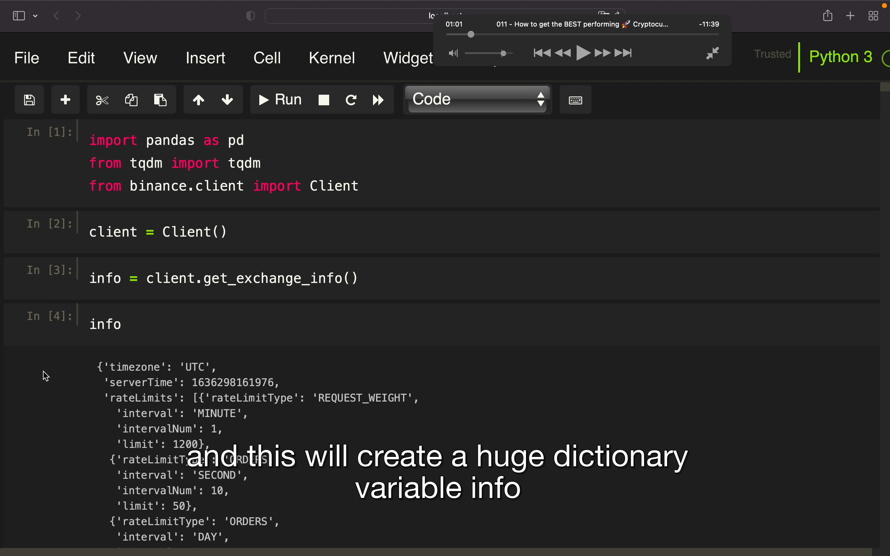
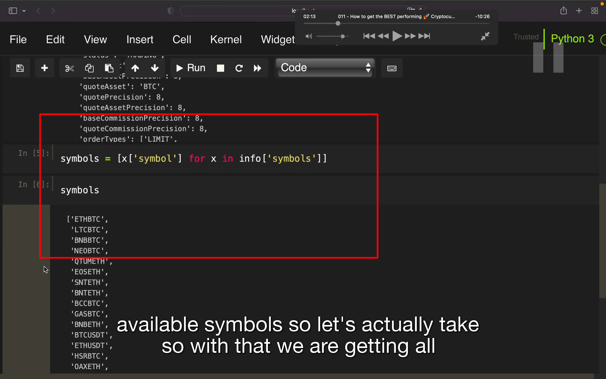
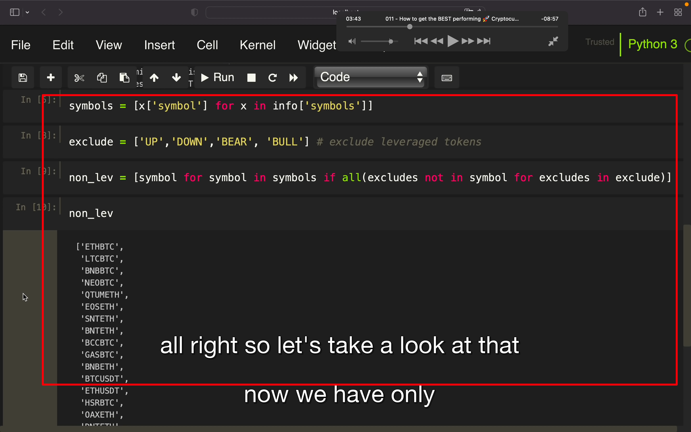
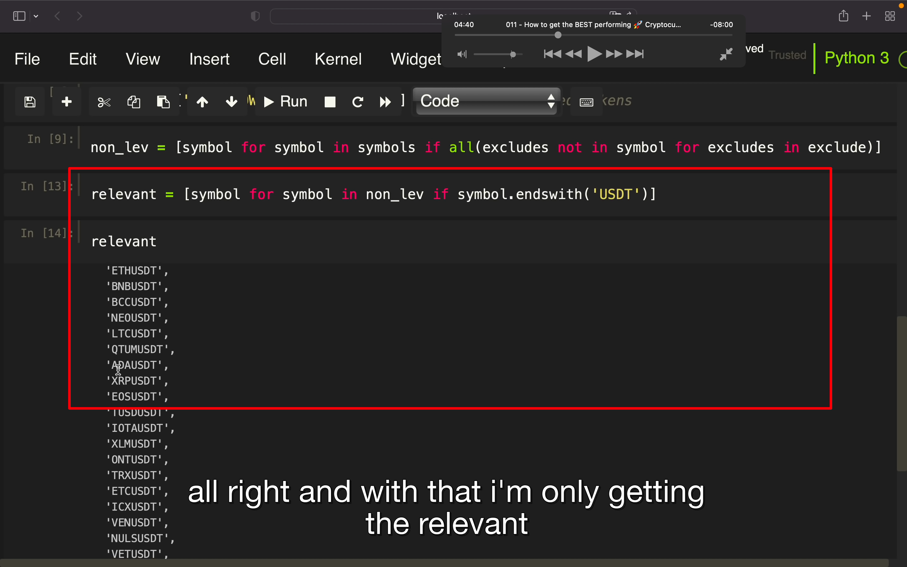
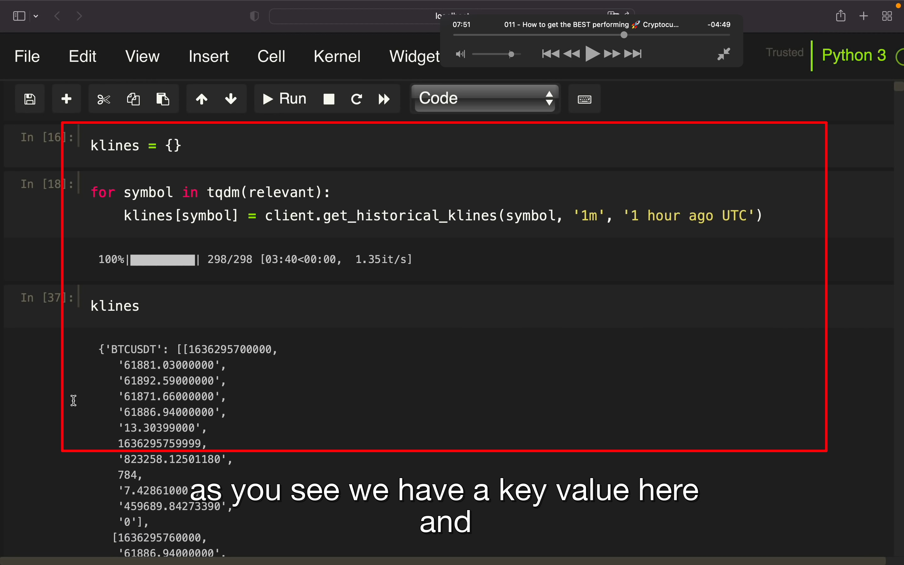
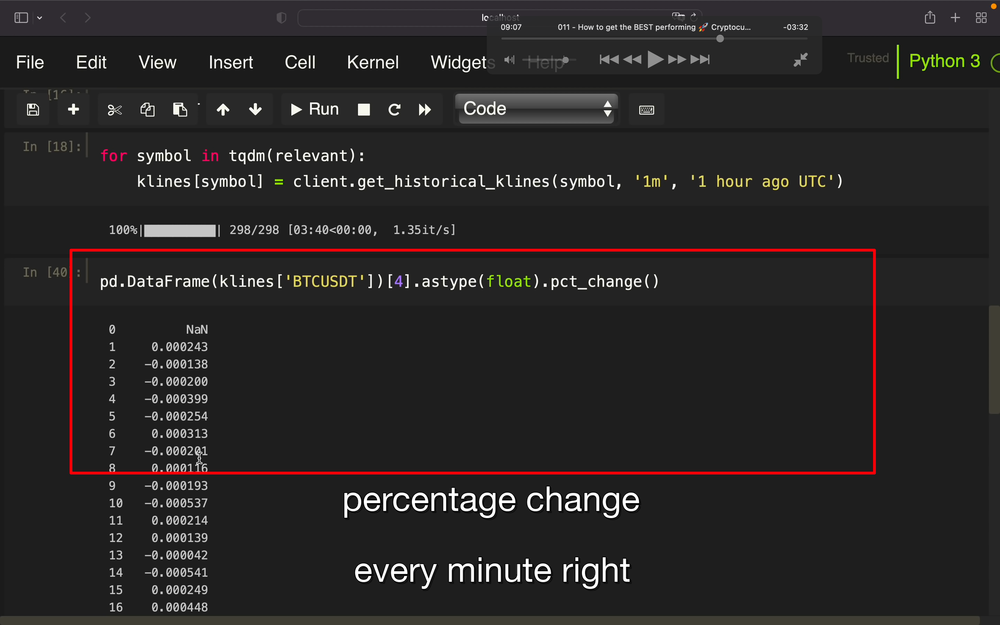
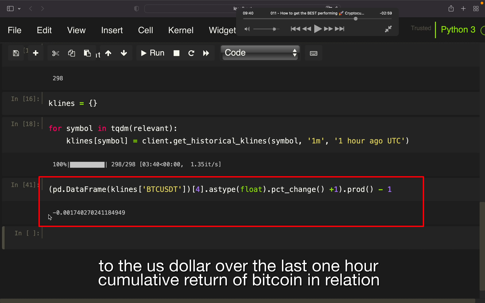
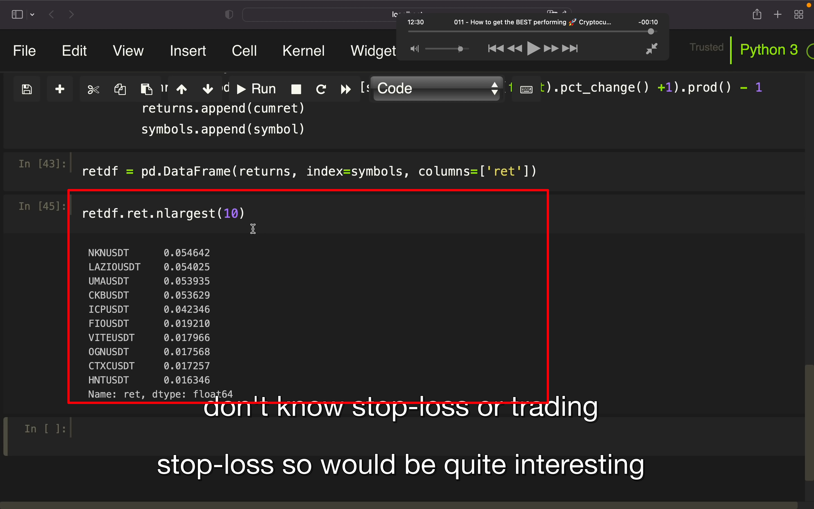

## 221119

## 此节获取数据的效率不高，因为此视频较早，后面应该会有效率更高的方法

</img>  
info

</img>  
获得 symbols  
用 len(symbols)可获得总数

</img>  
去掉带杠杆的 pair

</img>  
筛选出 usdt 交易对

</img>  
获得 kline，据说此方法效率不高

</img>  
此方法获得了每分钟变化量

</img>  
再上图的基础上做点修改就算出了一个交易对的一小时内改变量。

</img>  
找到各个 pair 的变化率。

</img>  
筛选出变化率最大的 10 个，之后可根据此变化率做交易。
