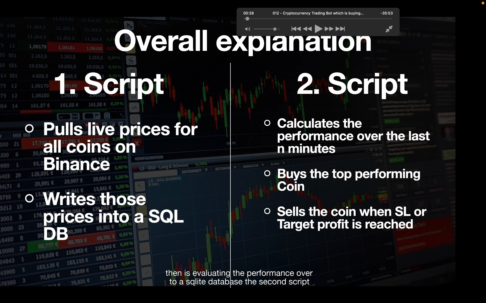
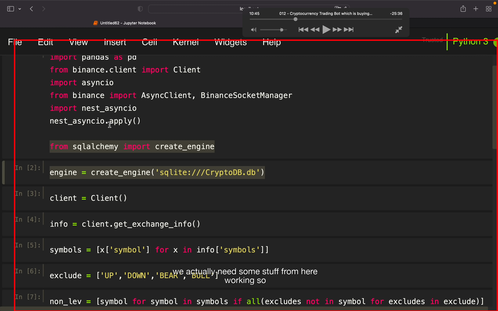
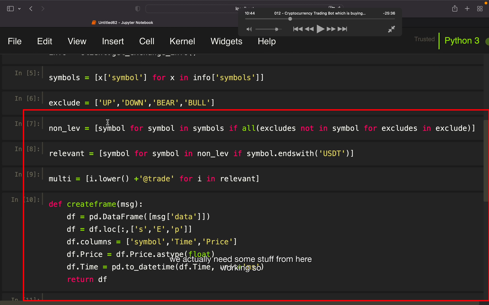
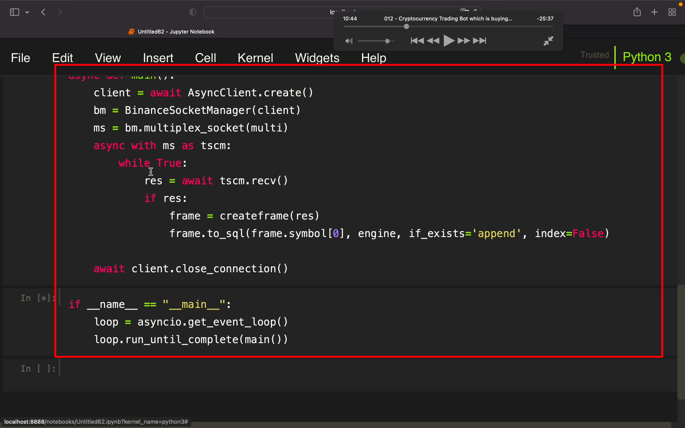
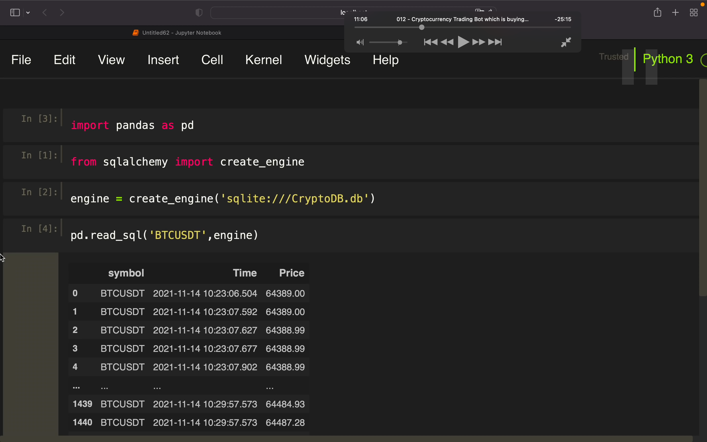
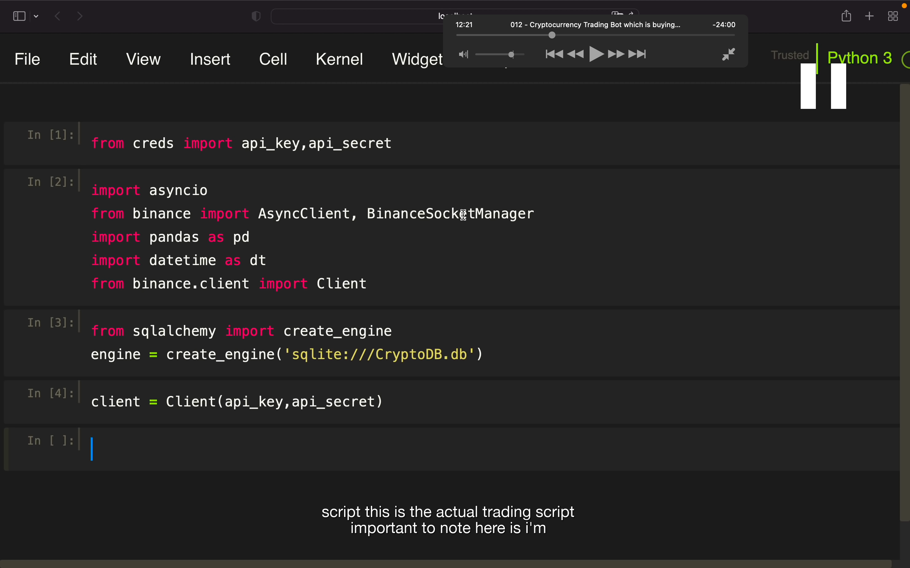
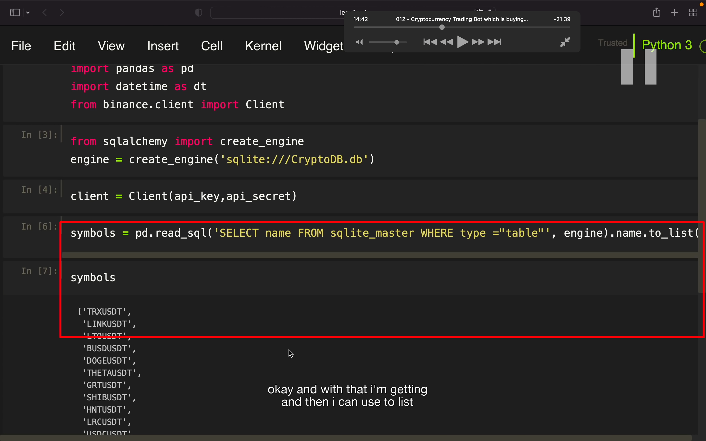
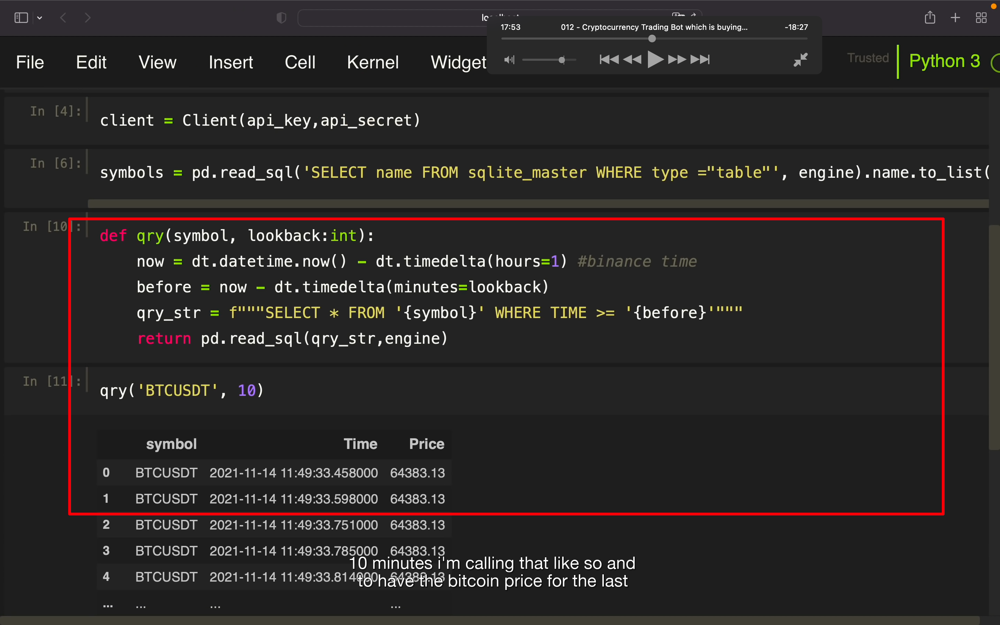
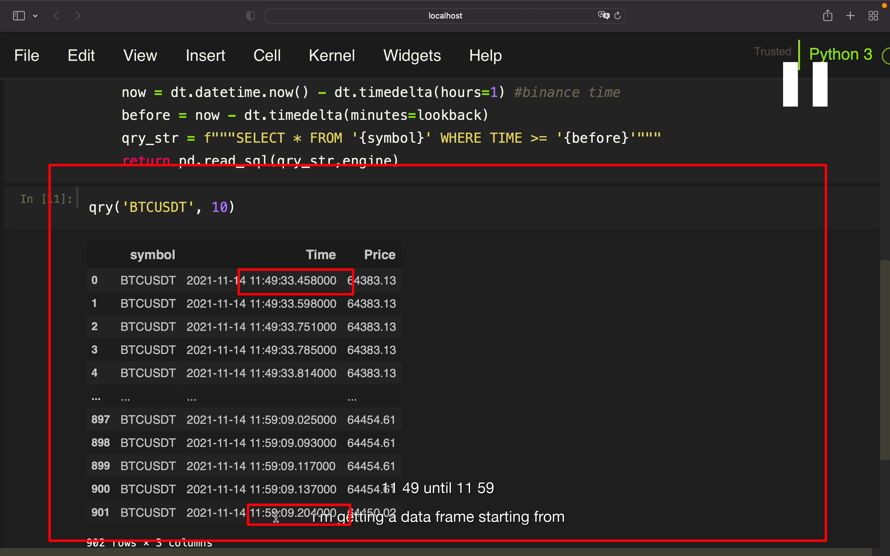

## 221120

</img>  
本期内容  
获取实时价格，存储这些价格到 sql db，算出最后几分钟表现最好的，止盈或止损

</img>  
--=  
</img>  
--=  
</img>  
获取数据并存入数据库的代码  
最后图被隐藏的部分是  
async def main()

</img>  
另一个脚本，获取上个步骤写入的数据  
可换为其它 symbol  
只是演示原理，实际是用下一个脚本来实施策略

</img>  
实际的策略脚本，需要注意它可以转换为纯 py 文件，之所以这样是因为之后想要每分钟定时执行它
creds 这一行可以直接用公钥，私钥代替  
datetime 用来在 db 中过滤数据，for the last n mins。

</img>  
--=  
</img>  
--=  
</img>  
获得了一个 symbol 距今 10min 内的数据。  
注意需要加减一个和币安相差的时差        

