## 221123

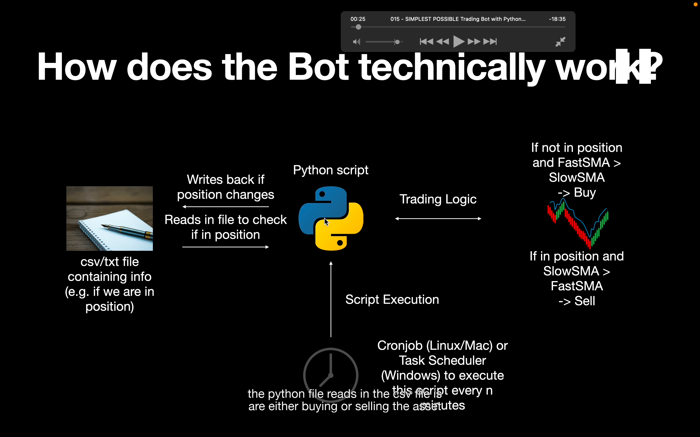</img>

创建一个 csv/txt 文件，包含想交易的 coin 和是否在 position 的信息。 当买卖 coin 后，此文件会变化  
py 文件会读取此 csv。获取价格信息，并实施交易策略  
策略是如果未在 postion（应该就是处于未买状态）时，且 fast sma 大于 slow sma 就买入。相反，如果在 position，且\*，则卖出。  
linux/mac 用 cronjob，win 用 task scheduler 来实现脚本执行。

需要前置视频：  
../02/42  
HUGE SCALE Backtest of Intraday Cryptocurrency Data using Python & SQL  
https://www.youtube.com/watch?v=HB1CLz0Z1NY

## add221124 本节特色是有 csv 文件，就能实现多个币种一起执行逻辑。大概做下笔记，需要时再详细看

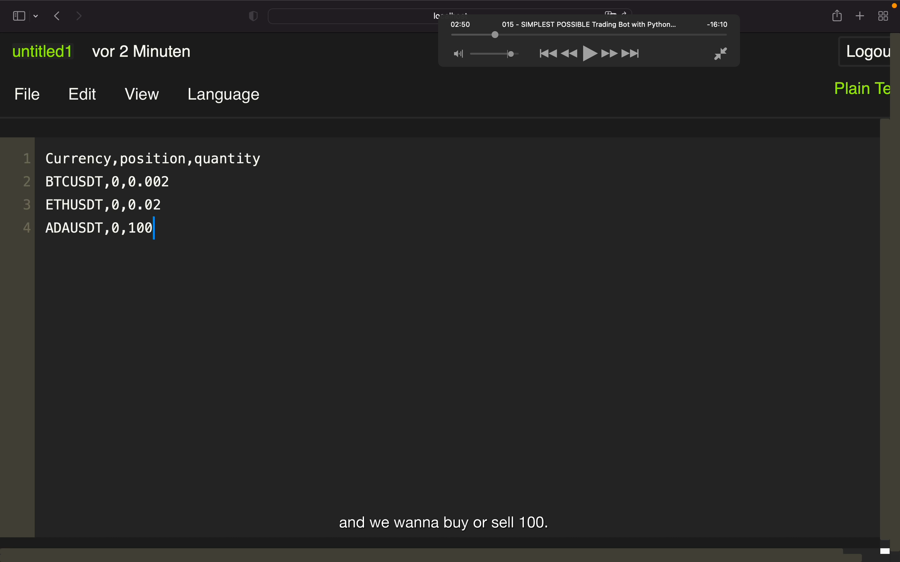</img>  
csv

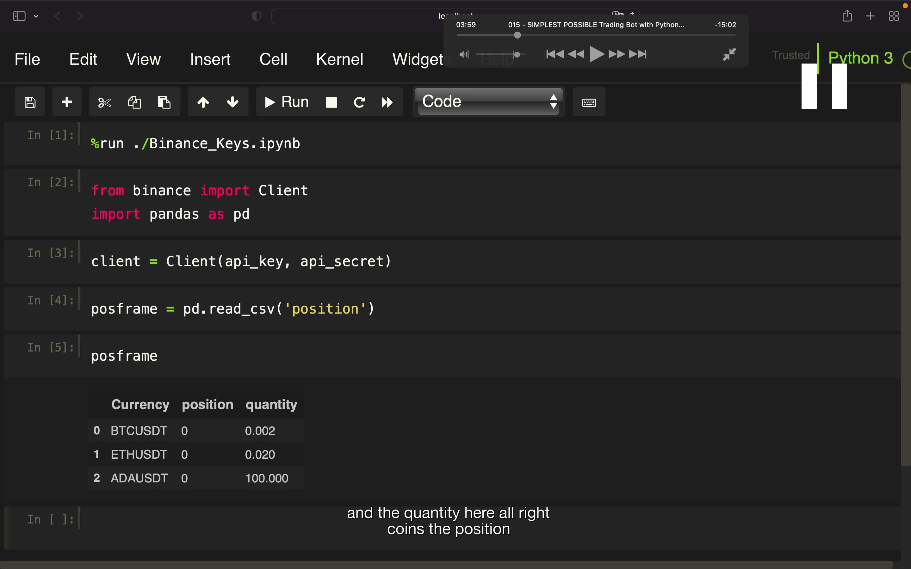</img>  
--=  
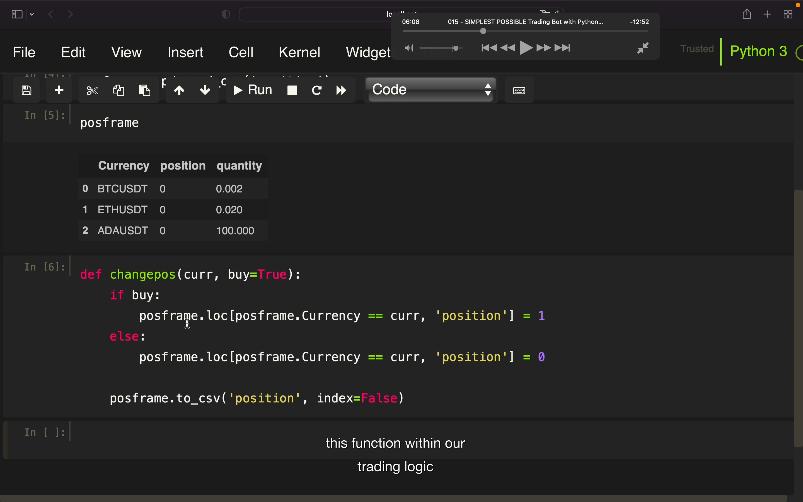</img>  
--=  
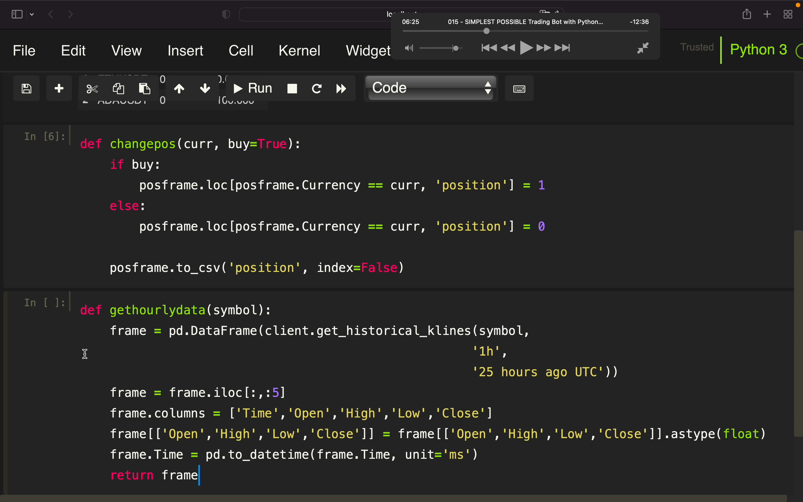</img>  
--=  
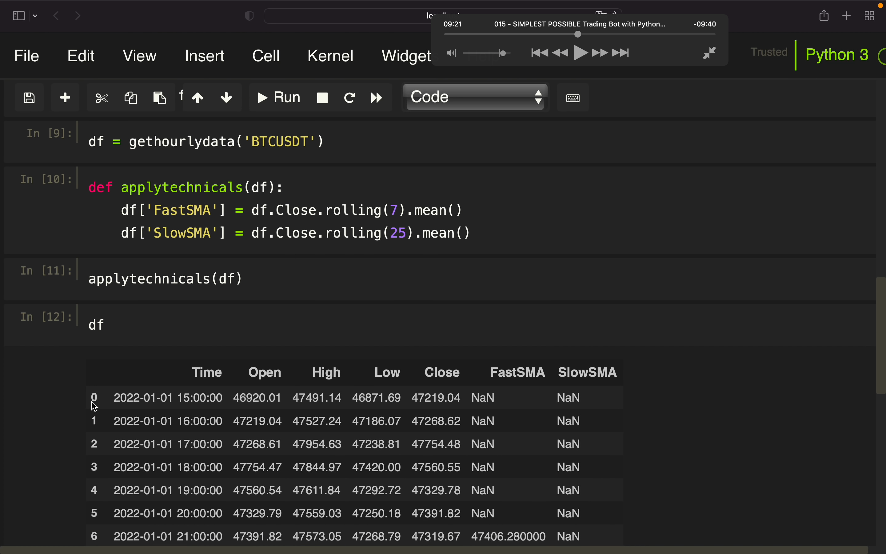</img>  
--=  
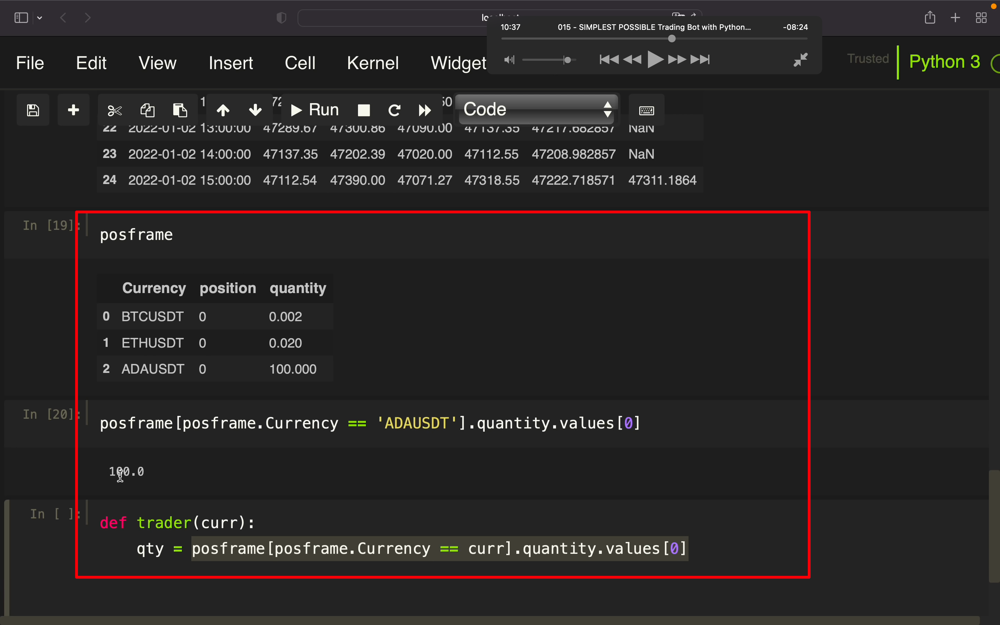</img>  
--= 过程  
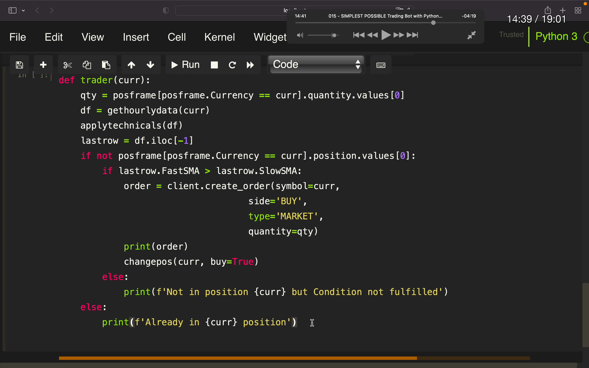</img>  
--=  
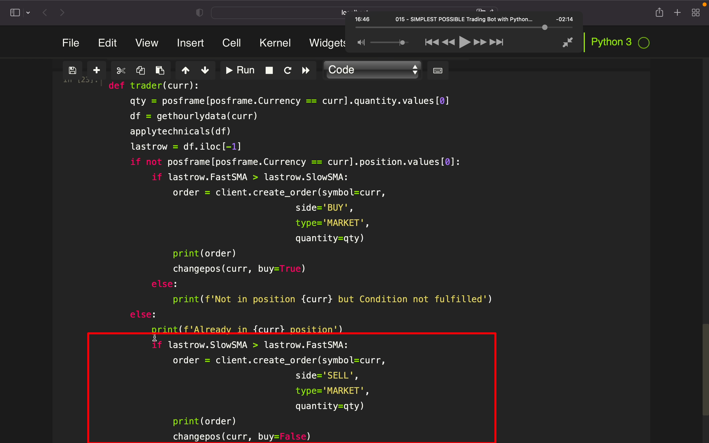</img>  
--=  
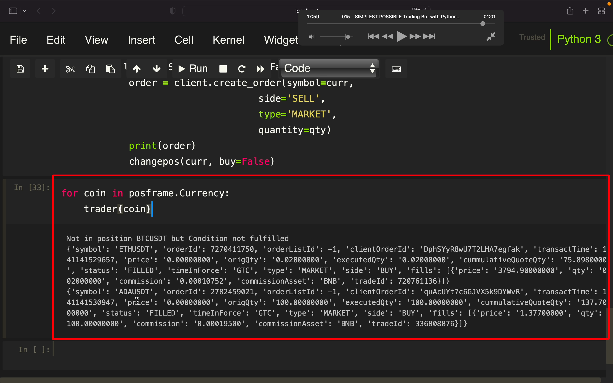</img>  
--= 定时执行  
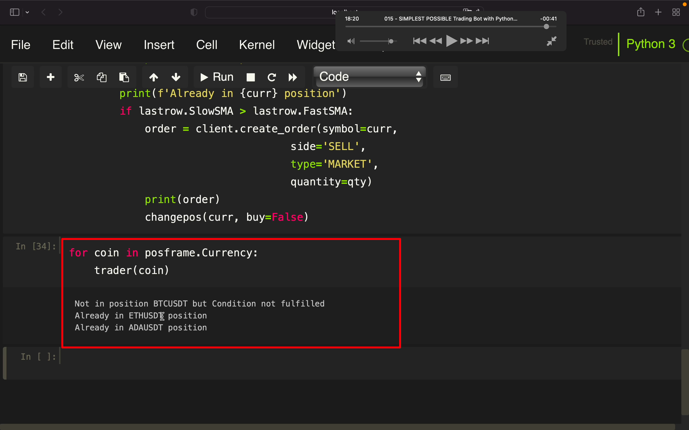</img>  
--= 定时执行
