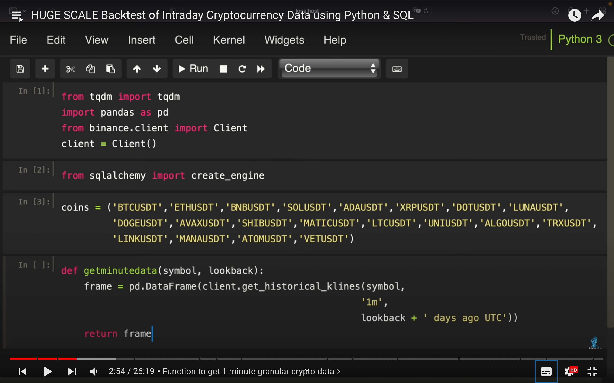
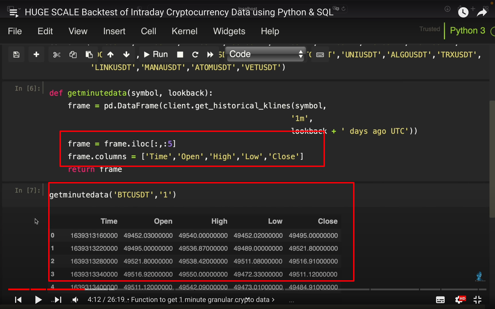
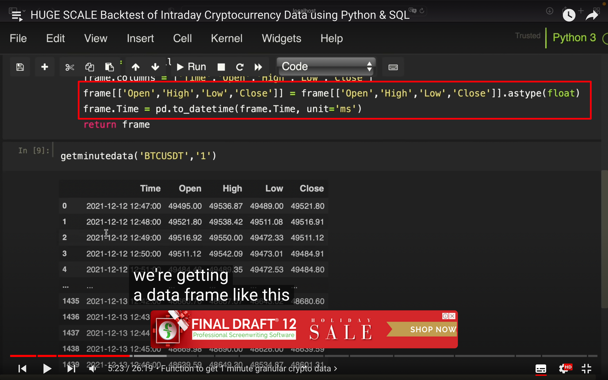
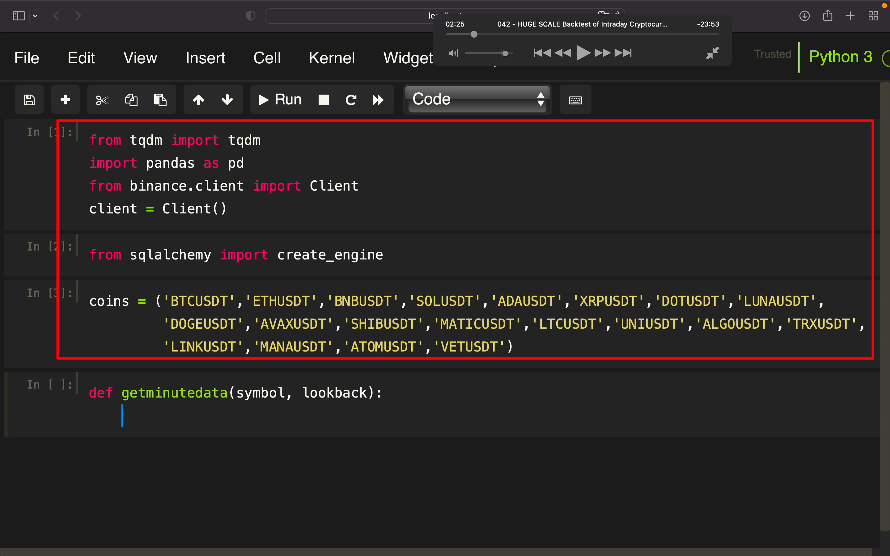
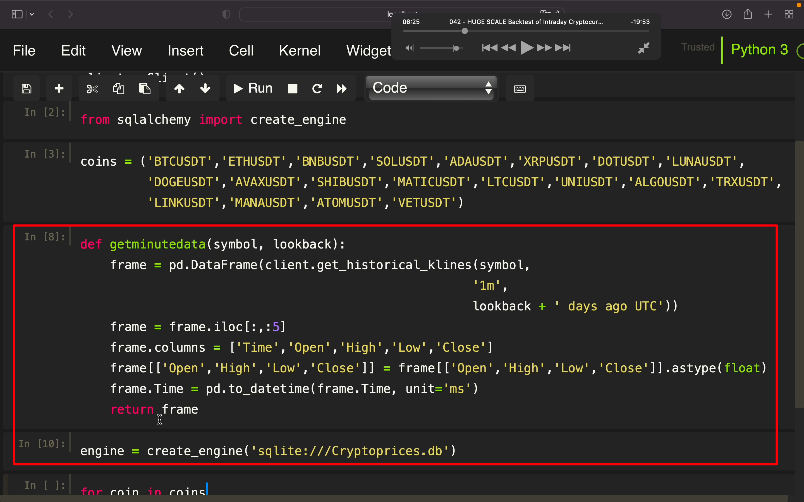
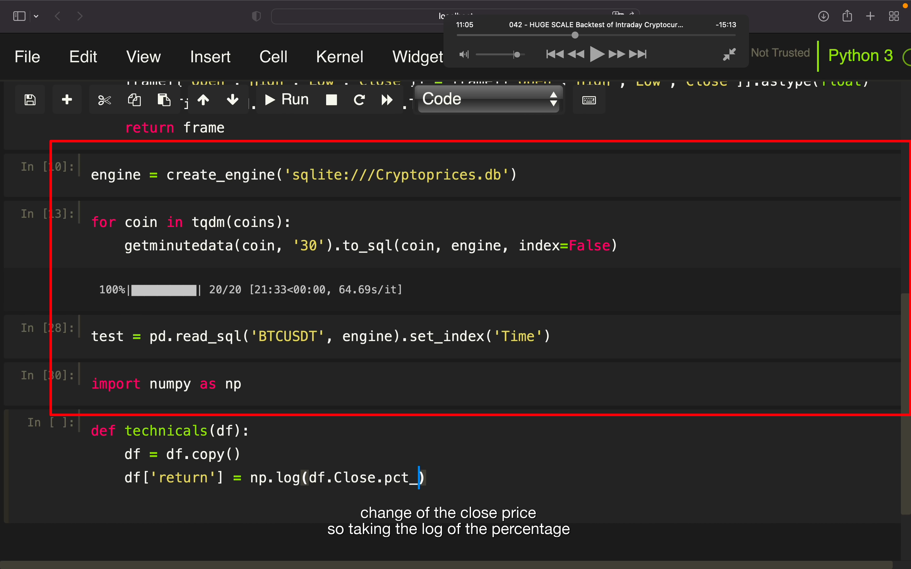
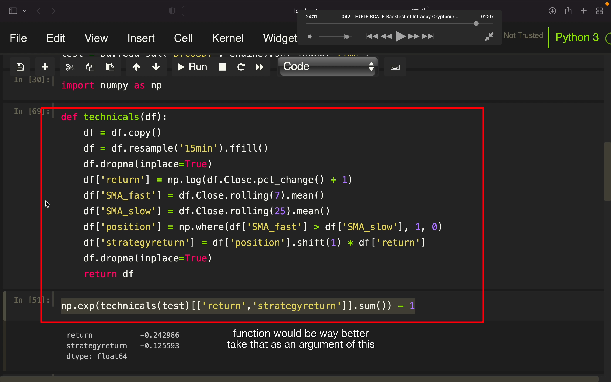
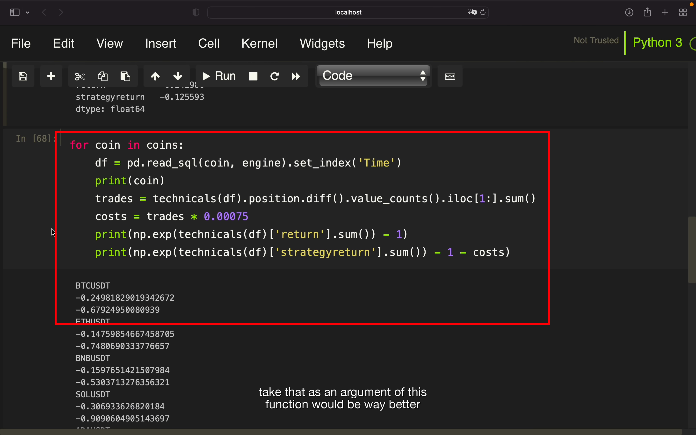

## 221123

```
coins = ('BTCUSDT','ETHUSDT','BNBUSDT','SOLUSDT','ADAUSDT','XRPUSDT','DOTUSDT','LUNAUSDT',
  'DOGEUSDT','AVAXUSDT','SHIBUSDT','MATICUSDT','LTCUSDT','UNIUSDT','ALGOUSDT','TRXUSDT',
         'LINKUSDT','MANAUSDT','ATOMUSDT','VETUSDT')

```

</img>  
初始代码  
tqdm to get a progress bar for a loop we are running，大概是在循环任务时图像化显示进度

</img>  
过滤之前数据

</img>  
将 string 转为 float 以计算它们  
将时间转为可读
之后就是得到 30 天内这样的数据，并将其写入一个 db。先写个 engine，再做个循环即可

## 之后的内容较繁琐，具体步骤省略，只截图以下整个脚本代码。但学到了做回测就是找到历史数据，每个 tick 和策略做对比，计算出每个 tick 的收益。再将所有 tick 收益加起来即为此时间段的总收益。

</img>  
--=  
</img>  
--=  
</img>  
--=  
</img>  
--=  
</img>
