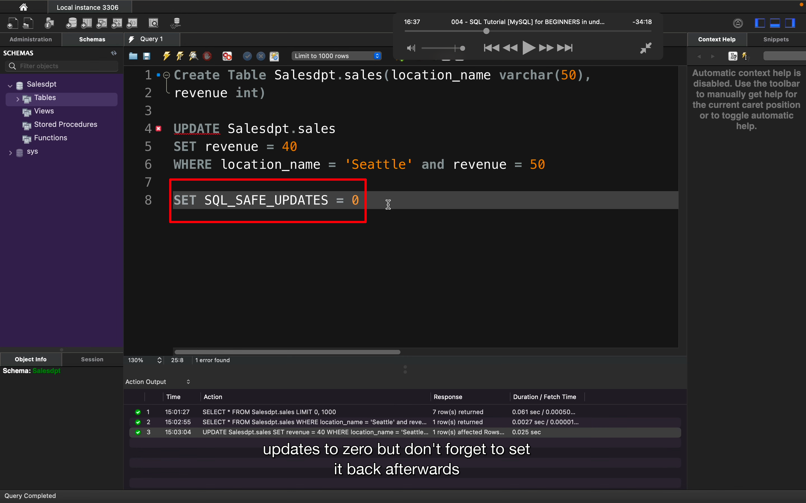
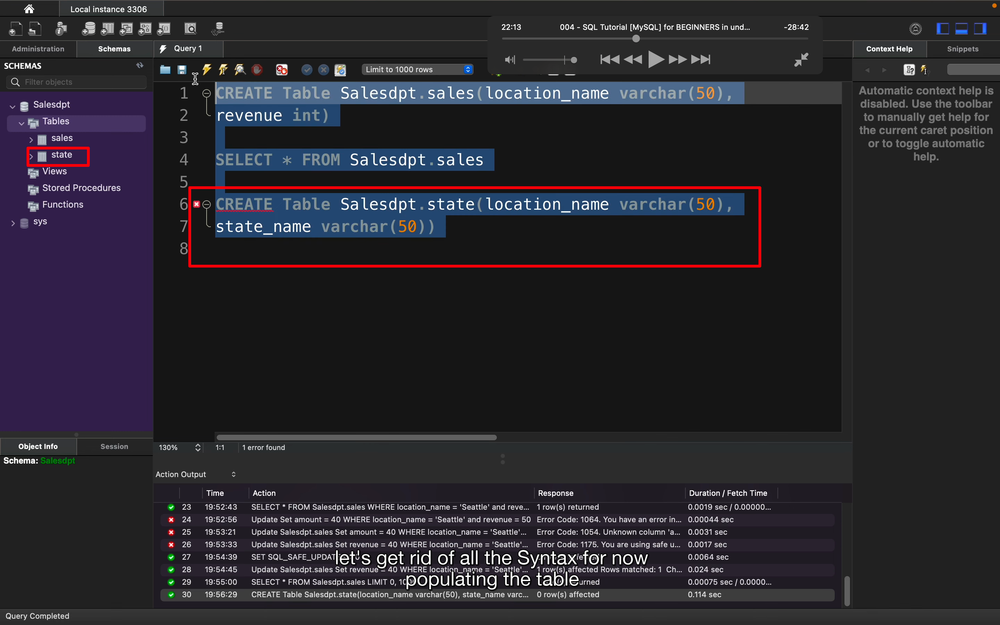

## 221102

</img>  
dbms 例举  
mysql 为本文所讲，且是开源的

</img>  
 mysql 下载方式，别选页面上方的 download，会付费。选页面下方此处

</img>  
mysql workbench

</img>  
在 mysql 中，schema 类似 db，在里面存放 tables，所以先创建个 db 或称之为 schema。以下简称 sm  
sql 不区分大小写，所以 CrEaTe 等同于 create  
输入如图，点击闪电图标，出现下方绿色反馈。再在左侧刷新就能显示此 sm 了。  
要删掉此 sm 输入 drop schema schemaname 点击闪电即可。  
这里 schema 可以写为 database，一样的效果

</img>  
之前只有 sm 没有 table，这里创建叫 sales 的 table，有两个 column，一个叫 location name 里面存储不超过 50 个字母的 text。一个叫 revenue，存储 int。

</img>  
这段意思是选择 sales table 的所有 column

</img>  
闪电执行后，显示如图的 cloumns，简称 clms

</img>  
执行步骤 2 给 clms 添加内容，但此时还无法显示内容，再执行 1 则可看到 3 的内容

</img>  
也可以筛选指定的 clms

</img>  
可以一次添加多组数据

</img>  
筛选出指定 clms 名的数据

</img>  
还可以加限定条件

</img>  
将 seatle 50 变为 seatle 40

</img>  
上一步有可能会遇到报错，如遇报错就这样设置，但之后需要设置回来

</img>  
1 是删除 sales table 的指定项，如没有第二行 where，则应该是 sales table 所有内容都删掉
2 的作用是在删除前确定要删除的内容

</img>  
aggregation function 举例

</img>  
1 显示其它内容  
2 筛选指定信息

</img>  
限定条件 group by
意思应该是把同名的合并，它们的数值相加

</img>  
新增一个叫 state 的 table

</img>  
为新 table 添加内容

## 221103

</img>  
inner join  
salesdpt.sales sales 是 salesdpt.sales as sales 的简写，下一行同理  
最终找出两者 location_name 值相同的项并列出来，注意此时 location_name 虽然一样，但还没有合并  
select\*from 的在左，inner join 的在右

</img>  
这样写就把之前的 location_name 合并了

</img>  
left join，from 那一行的全部显示，而 left join 那一行的只显示与上面有相同值的行，如此图的 san clemente

</img>  
right join。则 right join 一行的显示全部，from 那一行的只显示和 right join 一行有相同内容的部分

</img>  
在给 state，添加值过后，左侧也出现了 null

</img>  
删掉之前的，开始新增一个 schema

</img>  
在 sm 里新增一个 sales table，此 table 包含一个 primary key，它只是一个 unique identifier。它是一个只能含有唯一值的 clm，如 1，2，3 等等。此 clm 被叫做 id。  
1，因为是 primary key，所以不能是 null。  
2，这样增加数据时就会自动增加 id 也就是 key。  
3，应该是将 id 这个 clm 名设置为 pm key 的意思。  
4，int 数据站用量小，所以用 int 表示城市名。

</img>  
新增数据时，不用填 id，自动就填上了

</img>  
用 pm key 的方式新增另一个 table，用来存储城市名。

</img>  
sales table 里可以输入 location id 为 3 的数据，但实际上 location-name table 里并没有对应 3 的值，这个问题可以通过 foreign key 来解决。  
foreign key 是一个引用 inference，连接 sales table 和 location table。

</img>  
这里删除了之前的 sales table，重写了带 foreign key 的，引用了 locations table 里的 id。

</img>  
此时再输入 3 就会报错了。

</img>  
把两个 table 结合起来显示就能显示完整数据了。

</img>  
再处理下就可以将每个城市的收入汇总再显示了。

</img>  
1，空格代替 alias 更改 clm 名  
2，排序  
3，倒序

