## 221108

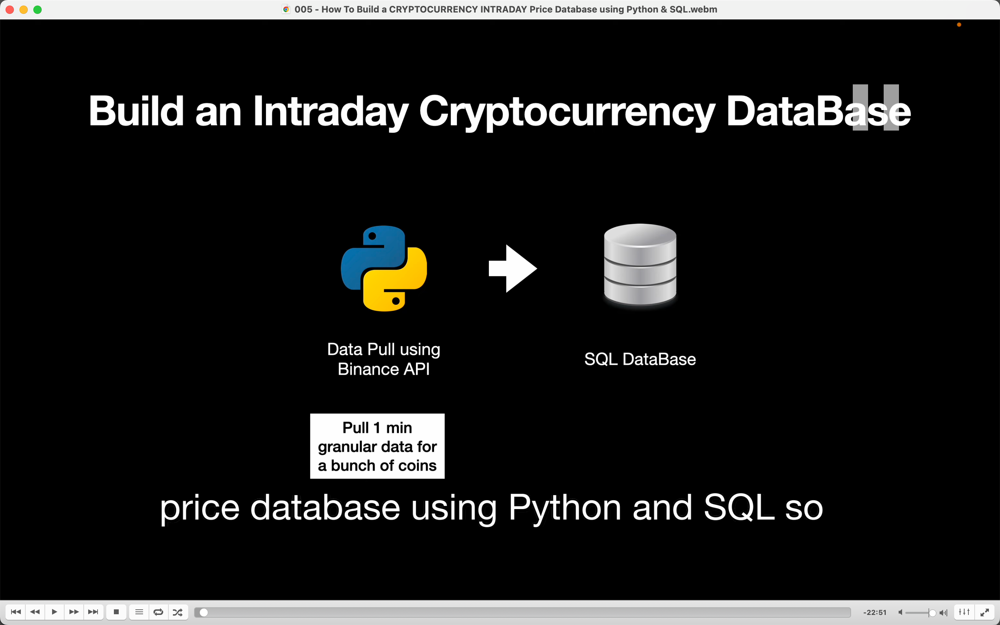</img>  
本节内容，创建一个当天的 cp 数据库  
用 py 脚本获取 binance 数据，然后写到 sql db。

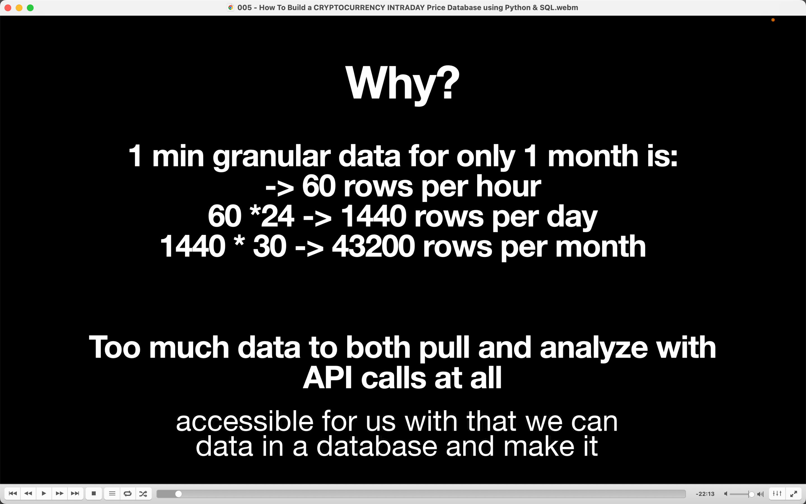</img>  
为什么这么做？因为数据量太大，如果只是在线 api 获取可能资源不够用。所以把数据获取下来后离线保存。

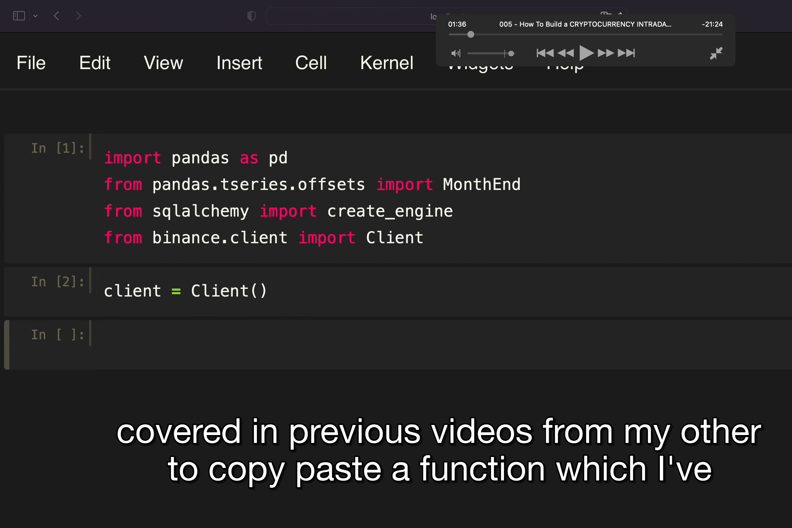</img>  
初始依赖  
MonthEnd 用于 jump month from one to another  
create-engine 用于连接到 sql  
Client 用于使用币安 api 获取 price data

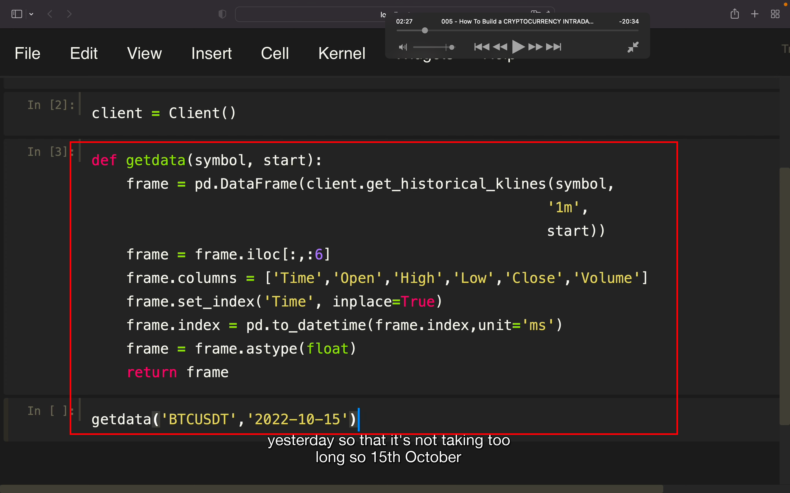</img>  
这是之前课程写的一个 function，具体讲解 aaav，需要修改它然后适合本节需求

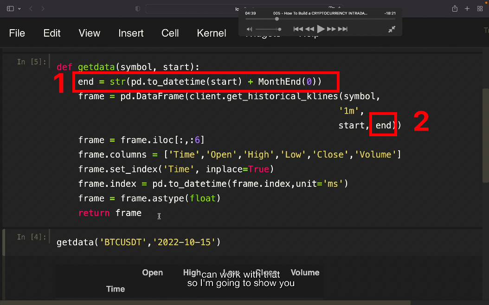</img>  
修改为以指定 date 开始的获取 1 分钟单位的 intraday data，直到当月结束。  
原因是想用此 function 写 data 进 sql。而且是 chunk by chunk  
1，end 用于获取当月结束时间，用 pd.to_datatime 将 start 从 string 转为 data boject。这样就能加上 monthend(0)跳到这个月的结尾处？？？ 最终用 str 包裹住再转换回 string  
2，这里加上 end 获取数据就能获取到当月截止，不然的话就是获取到现在时间

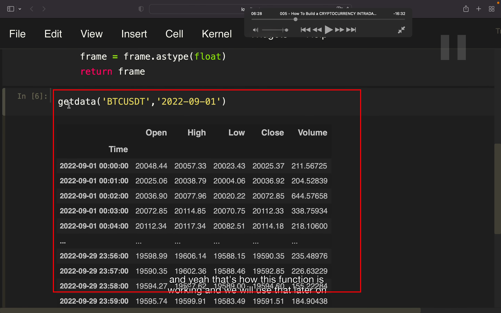</img>  
执行此命令，稍等段时间，就能获得此数据

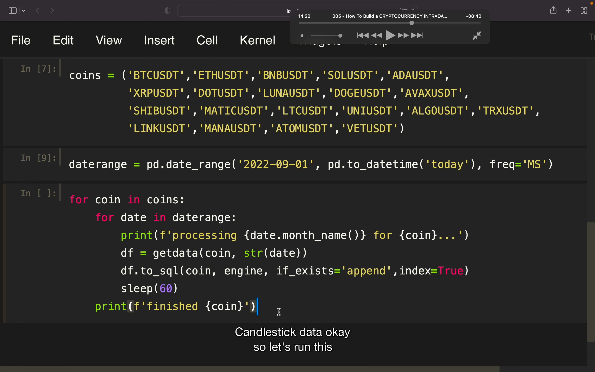</img>  
最终执行  
先在开头补上  
from time import sleep  
再在 client = client（）后补上  
engine = create_engine('sqlite:///Cointest.db')  
具体逻辑不太清楚，自己操作一遍后应该就能理解

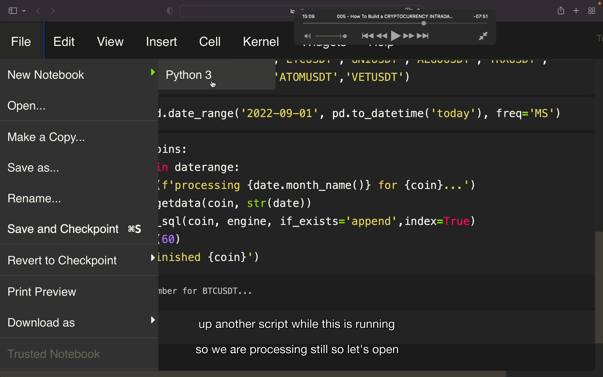</img>  
以上的脚本要运行很久，所以开始另一个脚本。注意他开启另一个的方法

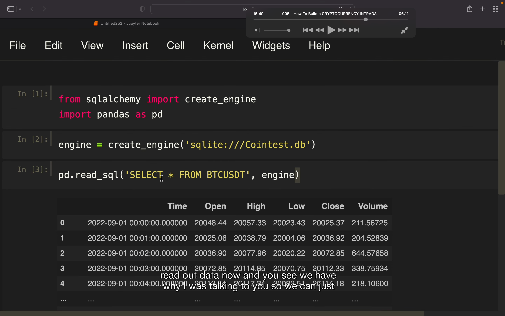</img>  
这样在另一个脚本里，就能读取到还未装载完成的数据库

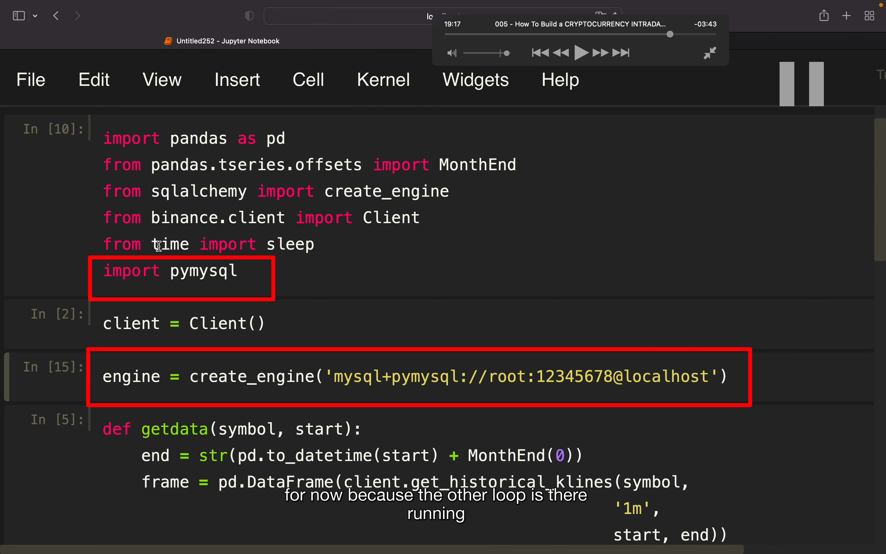</img>  
这里介绍 mysql 的方法，1234567 是密码，但是似乎默认不用写密码

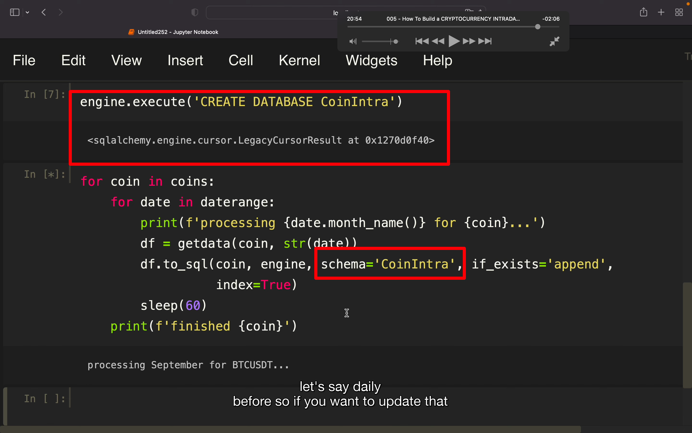</img>  
为了让 mysql 使用所做的另外的修改，database 可以换为 schema

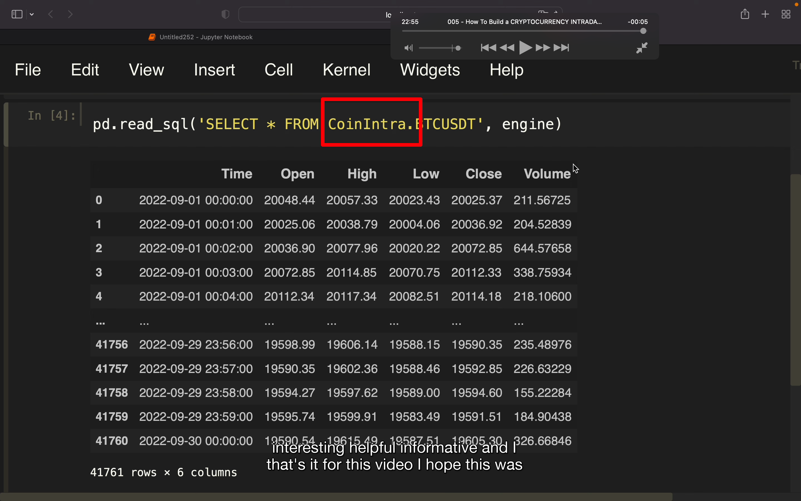</img>  
用 mysql 最后在读取时也要加上这个 table name？？？
