## 221102

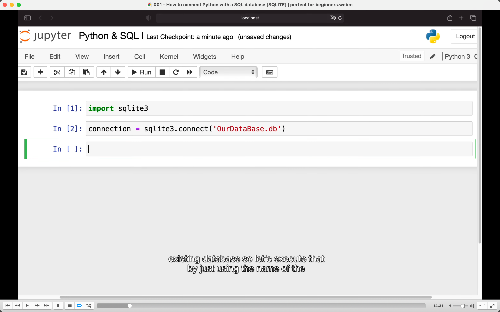</img>  
创建 db，已有则连接，没有则创建

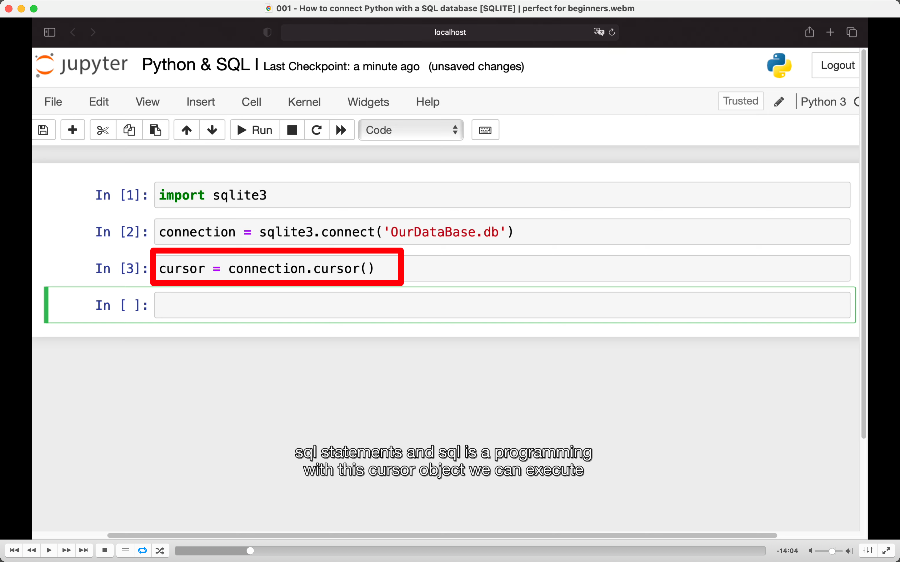</img>  
cursor 用来执行 sql statements

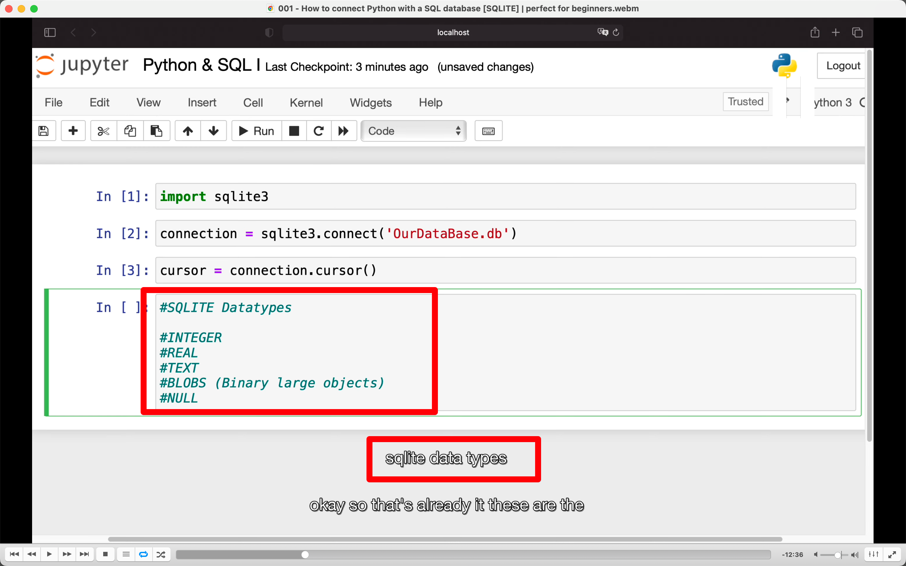</img>  
aaap  
比如图片等二进制文件是 blobs

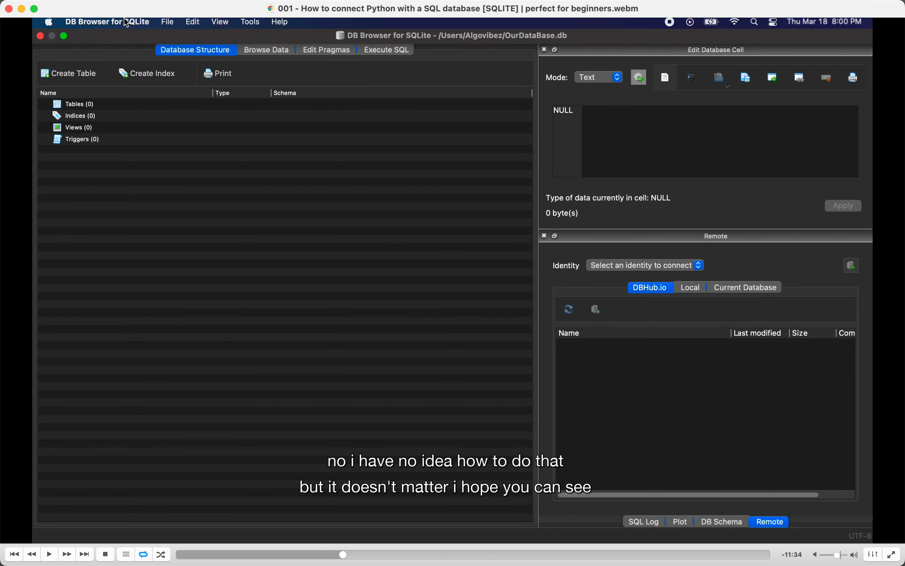</img>  
db browsers for sqlite 来查看 sql db
tables 表
indices 索引
views 视图
triggers 触发器

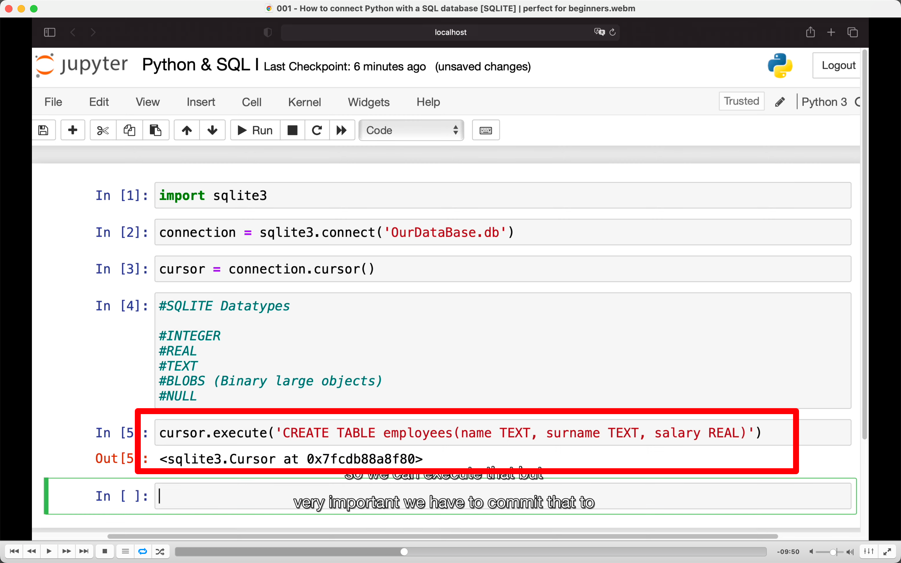</img>  
create 分别是列名和类型

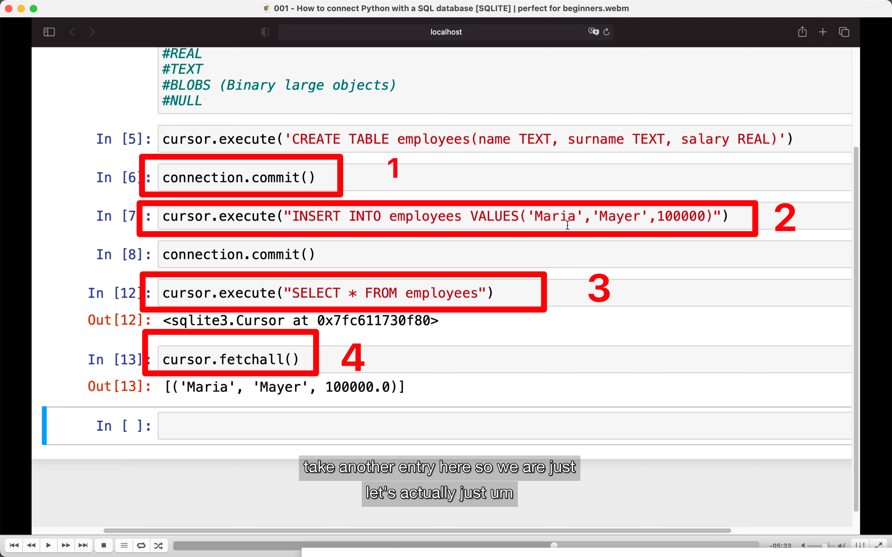</img>  
1, 视频说要 commit，软件才能看见，但实际操作时没 commit 也看见了  
2，insert 数据  
3，select  
4，fetchall，执行第二遍就会得到空数据，得先再执行一下 select，相当于 fetchall 后就取消掉 select 了

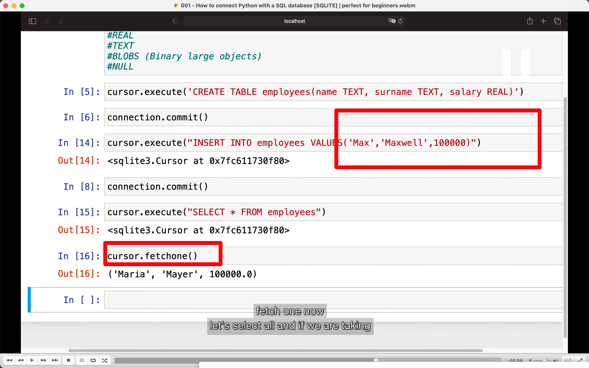</img>  
再 insert 一个数据，下面 fetchone，先是 maria，再执行一次就是新增的 max 了。

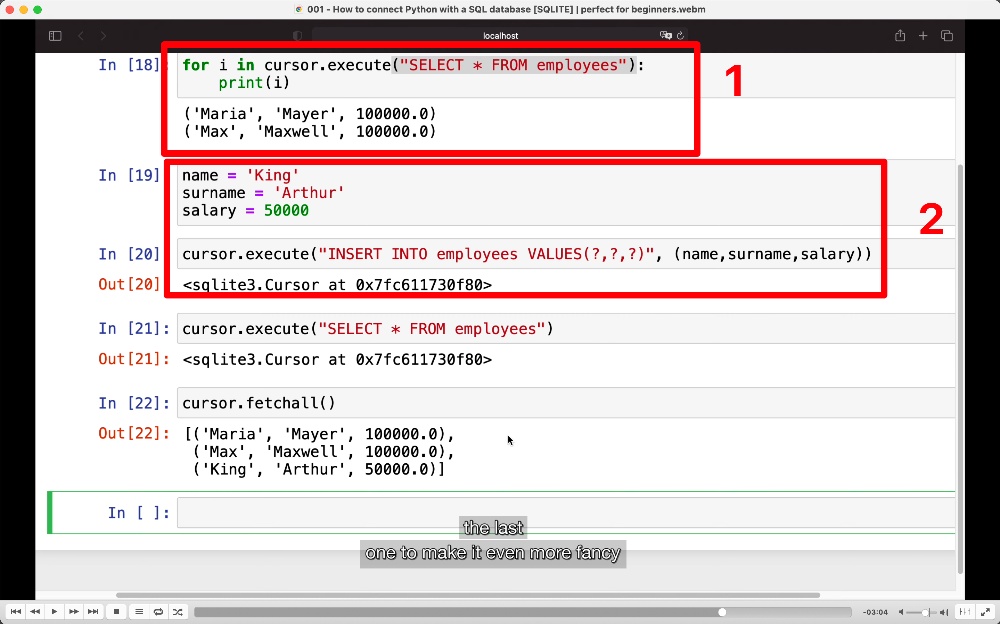</img>  
1，for 循环  
2，变量方式添加

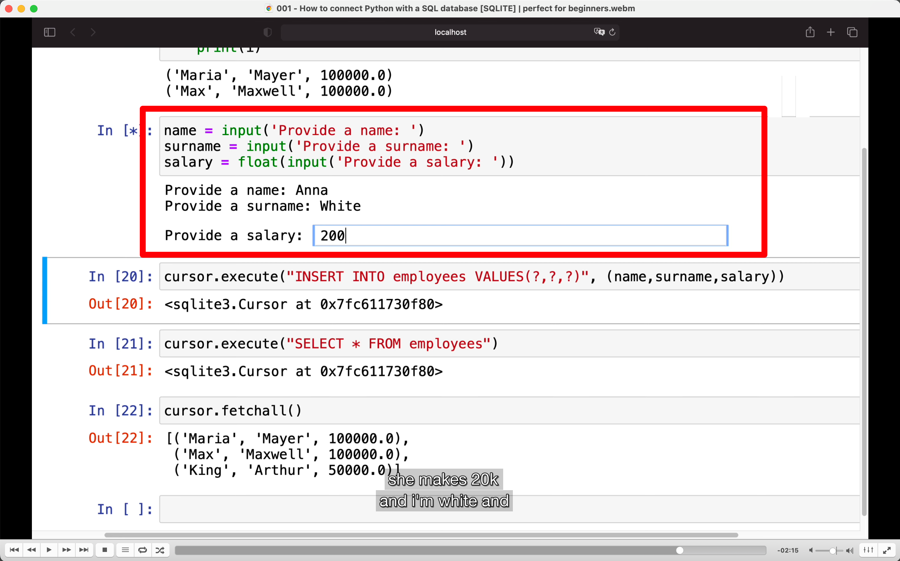</img>  
自己输入的方式

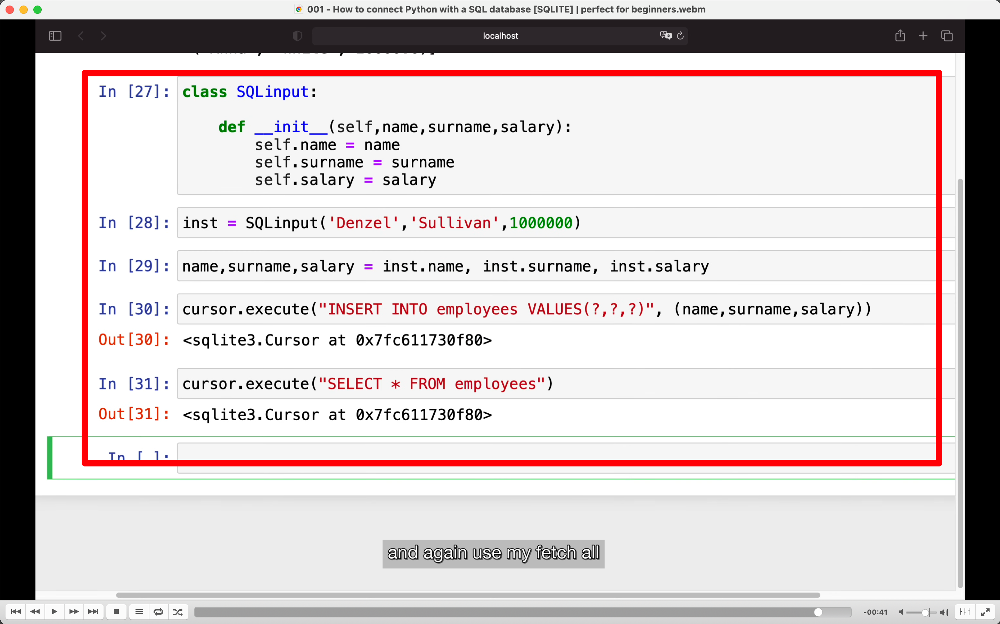</img>  
--=  
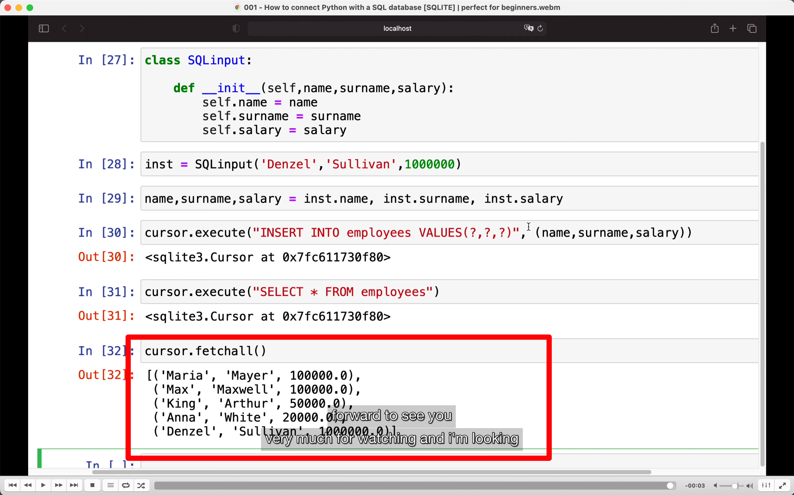</img>  
构造函数方式
