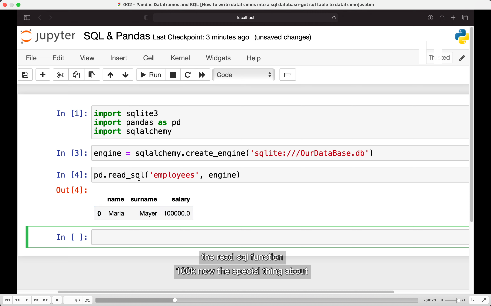
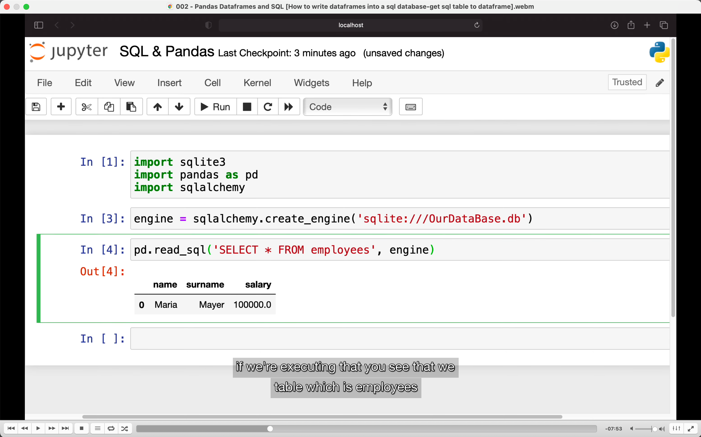
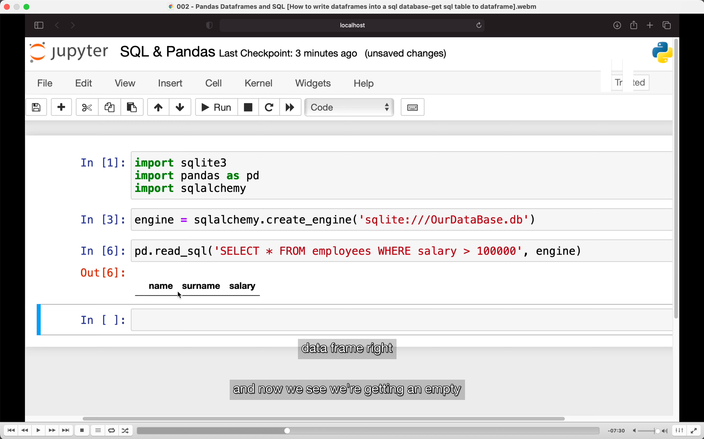
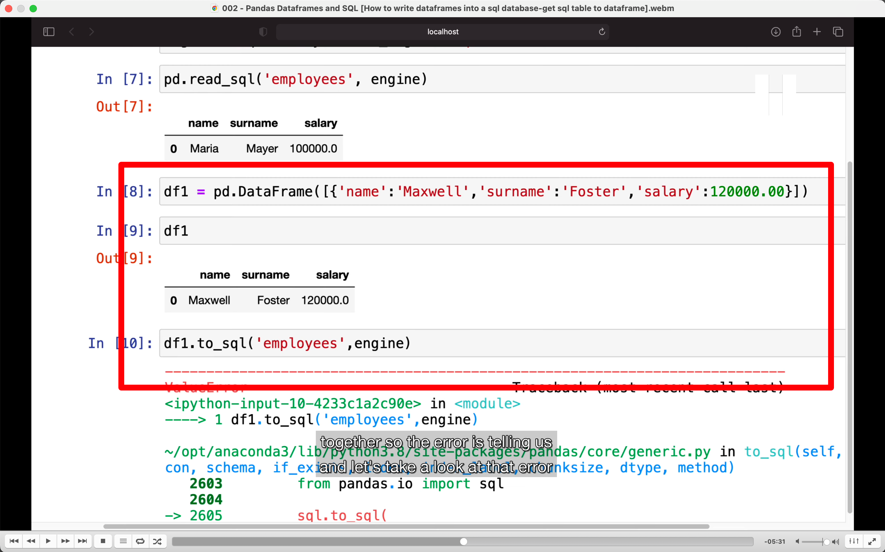
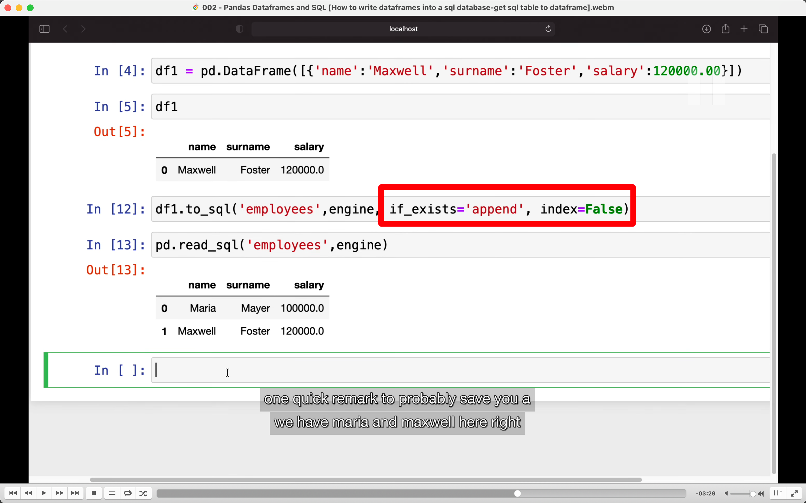
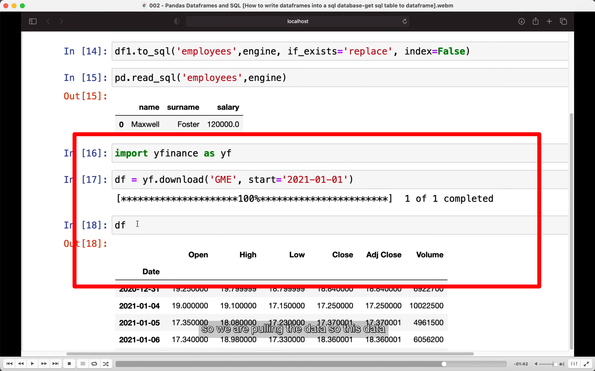
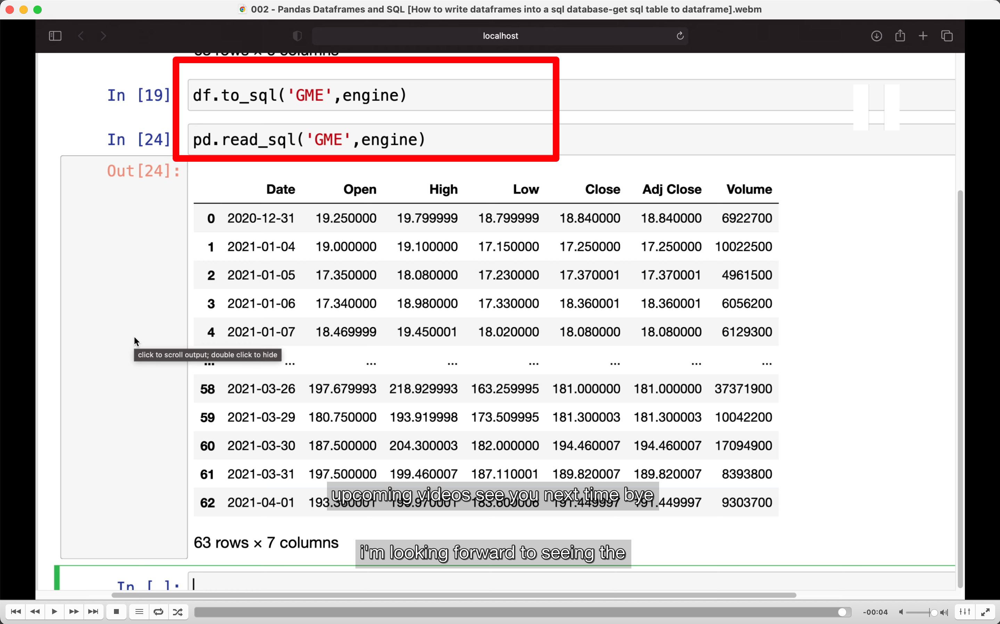

## 221102

## getting data from sql db into panda df, storing panda df into sql db

</img>  
1，使用 engine 而不是上节课的 connection，因为使用 mysql 或 mssql 时需要 engine  
2，要使用 engine 需要首先 !pip install sqlalchemy，截图没显示出来

add221108  
如果是在 ipython 命令行或者 jupyter notebook 中要执行 pip 命令，就需要加感叹号，表示我要执行的是系统的命令，而不是 Python 语句

</img>  
--=  
</img>  
两种方式使用 read_sql，第一种如之前图，输入 table name 就行。第二种如图使用 sql statements，第二种可以加限定过滤条件

</img>  
这部分是写 df into sql table  
这样写会 error，因为 to_sql 是创建一个新的 table，但已经有了一个叫做 employee 的 table。

</img>  
 加入这两段就能从创建一个新的 table 变为在已有的 table 里加入内容  
 因为之前的数据没有 index，所以这里指定 index=false

</img>  
 通过 yfinance 获取金融数据

add221108  
如未预先安装，仍然需要!pip install yfinance

</img>  
把上一步获取的 df 写入 sql 并从 sql 中读取此数据
