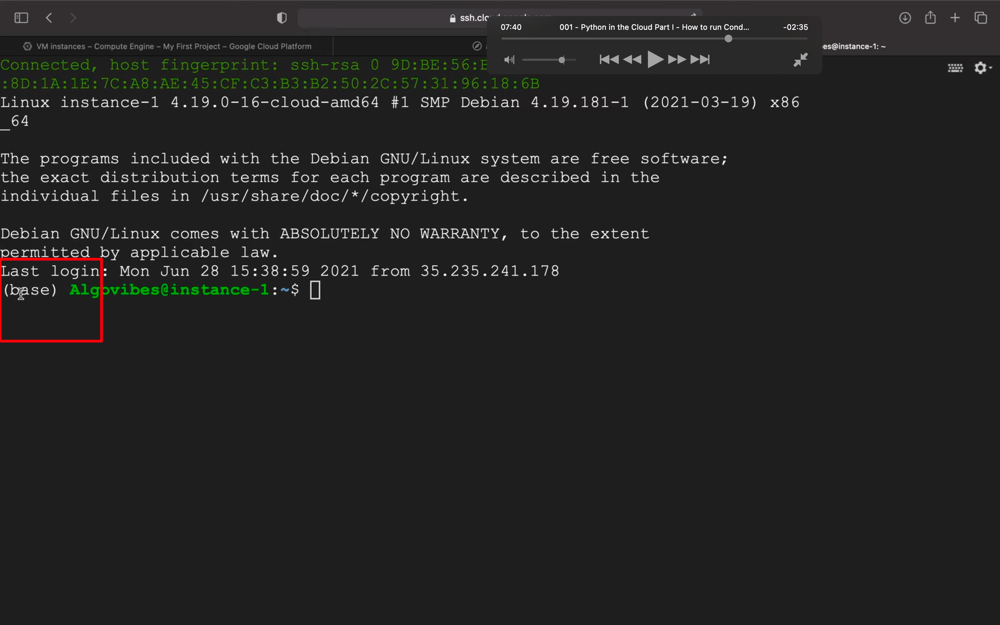
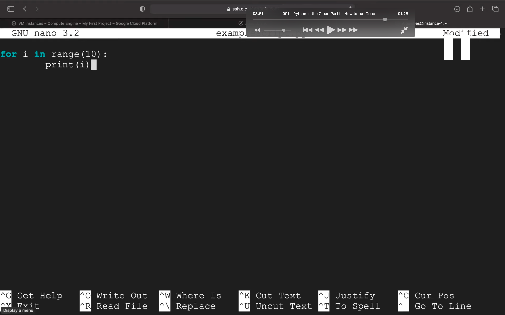

## 221121

## 作者用的 gcp，即谷歌云，但中国用户无法注册。所以选择其它 vps，然后选 Debian gnu/linux10 version，1c1g 即可。

## 暂只看此课学习如何在 vps 装 python 环境就行，下一课需要用 gcp 自带的 sql db，无法学习。

https://www.youtube.com/watch?v=lIJlhKrP_SI&list=PL9ATnizYJ7f9ZGSx-7siizxqh4VtRZblk&index=1

minicorner

sudo apt-get install wget  
wget https://repo.anaconda.com/miniconda/Miniconda3-latest-Linux-x86_64.sh  
bash Miniconda3-latest-Linux-x86_64.sh  
回车  
空格\*n  
yes  
回车  
yes

</img>  
重启 vps 后，看到命令行开头有 base，证明安装成功

</img>  
nano 存储如图脚本  
python 脚本名.py 即可看到效果
