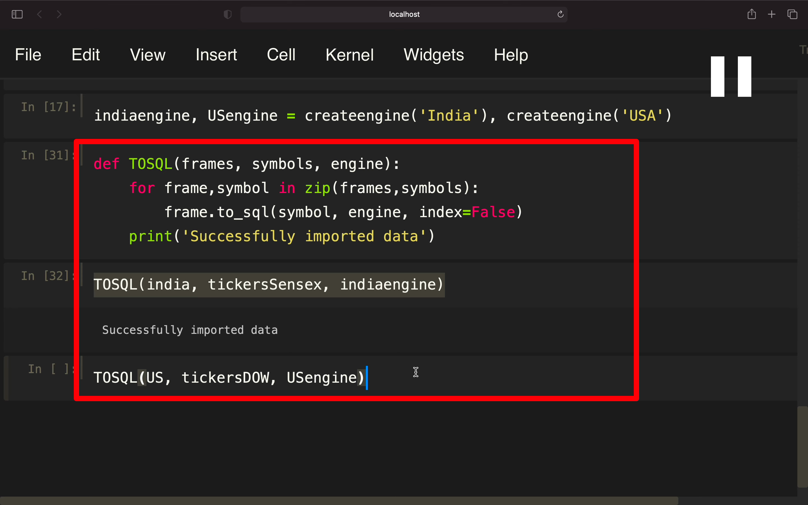

## 221102

## 构建自己的 fi db，包含股价等信息

</img>  
这两个分别是获得印度股票和道琼斯指数的 symbol

</img>  
获取 data，要下载较长时间

</img>  
--=  
</img>  
显示出来的 df

</img>  
此 function 用于创建 db engine，只适用于 sqlite db，如果用于 mysql 或其它，则需要 schema  
此处创建了 india 和 us 两个 engine

</img>  
将 两个 df 存入 两个 db 的函数  
还未写完，这部分意思是让 df 的各种数据和 symbols 一起遍历

</img>  
--=  
</img>  
这部分实际无需运行，只是看下具体内容，us[0]的意思是第一个股票 symbol 对应的数据。

</img>  
执行完成

</img>  
软件查看相关数据

</img>  
--=  
</img>  
读取 apple 数据，以及筛选出 winning day 的数据。

</img>  
注意带点号的数据要加引号包裹，因为点号在 sql 中是有意义的
