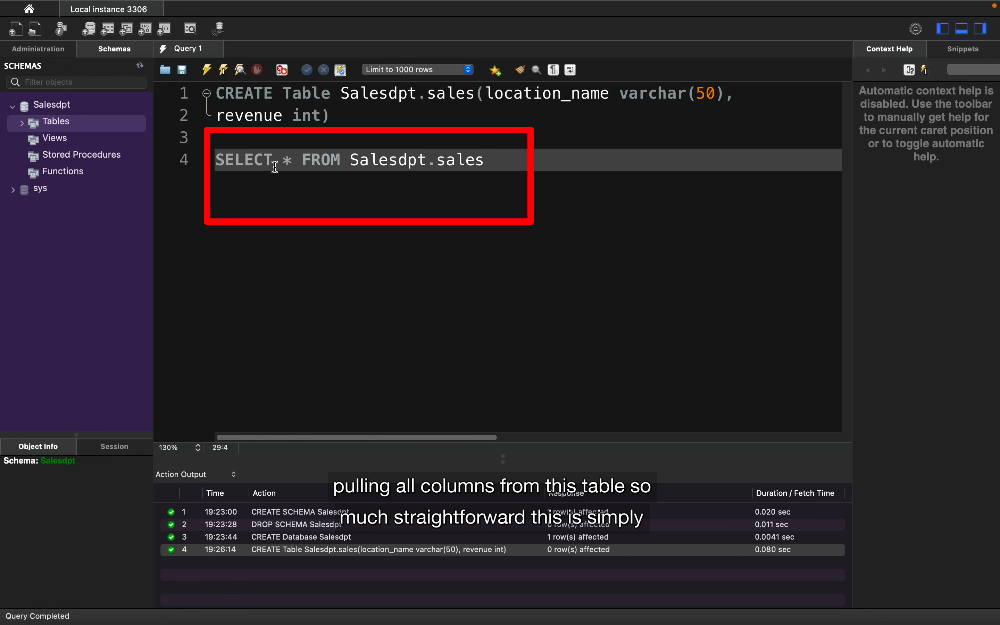
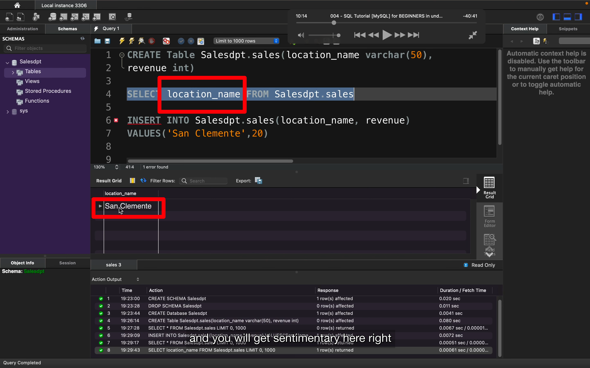
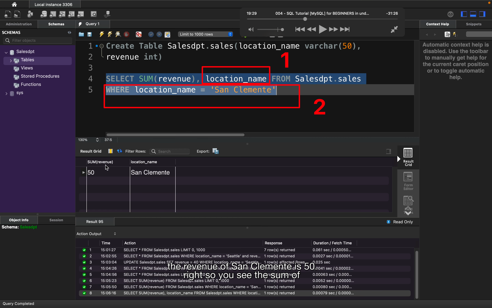

## 221102

</img>  
dbms 例举  
mysql 为本文所讲，且是开源的

</img>  
 mysql 下载方式，别选页面上方的 download，会付费。选页面下方此处

</img>  
mysql workbench

</img>  
在 mysql 中，schema 类似 db，在里面存放 tables，所以先创建个 db 或称之为 schema。以下简称 sm  
sql 不区分大小写，所以 CrEaTe 等同于 create  
输入如图，点击闪电图标，出现下方绿色反馈。再在左侧刷新就能显示此 sm 了。  
要删掉此 sm 输入 drop schema schemaname 点击闪电即可。  
这里 schema 可以写为 database，一样的效果

</img>  
之前只有 sm 没有 table，这里创建叫 sales 的 table，有两个 column，一个叫 location name 里面存储不超过 50 个字母的 text。一个叫 revenue，存储 int。

</img>  
这段意思是选择 sales table 的所有 column

</img>  
闪电执行后，显示如图的 cloumns，简称 clms

</img>  
执行步骤 2 给 clms 添加内容，但此时还无法显示内容，再执行 1 则可看到 3 的内容

</img>  
也可以筛选指定的 clms

</img>  
可以一次添加多组数据

</img>  
筛选出指定 clms 名的数据

</img>  
还可以加限定条件

</img>  
将 seatle 50 变为 seatle 40

</img>  
上一步有可能会遇到报错，如遇报错就这样设置，但之后需要设置回来

</img>  
1 是删除 sales table 的指定项，如没有第二行 where，则应该是 sales table 所有内容都删掉
2 的作用是在删除前确定要删除的内容

</img>  
aggregation function 举例

</img>  
1 显示其它内容  
2 筛选指定信息

</img>  
限定条件 group by

</img>  
新增一个叫 state 的 table

</img>  
为新 table 添加内容     

