## 221103

https://www.youtube.com/watch?v=uD8ydr_iueo&list=PL5vhgcQtYl3jUJdxo6xgcCQsYuN7x91vT

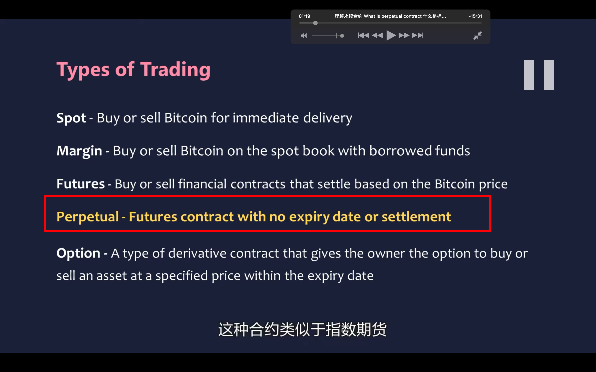</img>  
spot 现货  
margin 可以加少量杠杆  
futures 期货合约，有交割时间，保证金交易，遵守金融理论中的期货定价原理  
perpetual 这里简写为 pp，今天主要介绍的永续合约。类似指数期货。无到期日。通过引入资金费率机制来让价格贴近现货价格。
option 期权。币圈较晚出现，较复杂，先不了解。

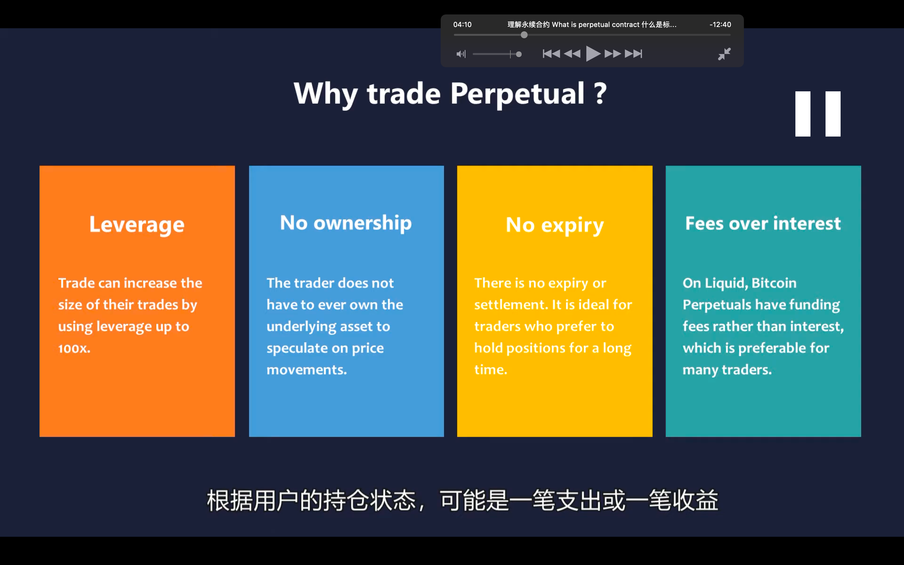</img>  
pp 的优点

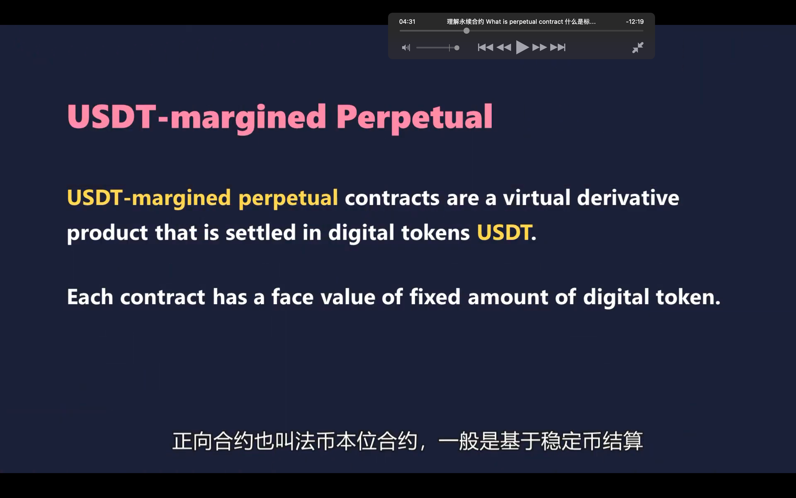</img>  
正向合约也叫法币本位合约，基于稳定币如 usdt 进行结算。收益也是稳定币。好处是只需持有法币，不须持有资产即可交易

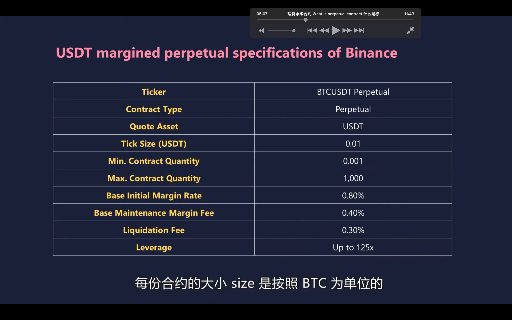</img>  
币安正向合约说明书

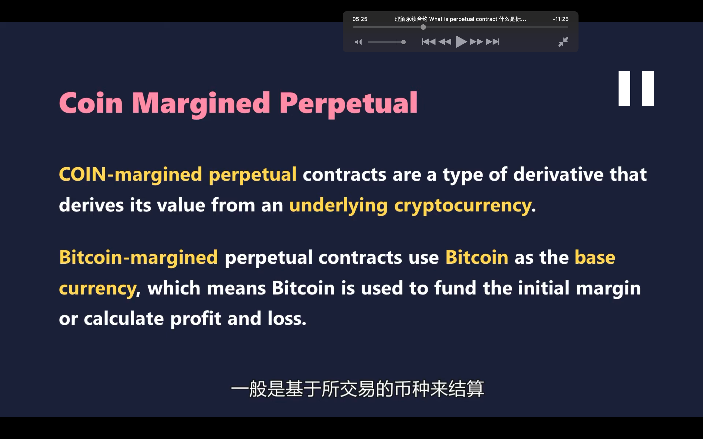</img>  
反向合约叫币本位合约，跟想的不一样，反向合约交易量是正向的 3 倍，可能是因为看好币价上涨用币本位做多赚的更多？

</img>  
pp 两个价格指标，最新成交价和标记价格  
为避免价格高波动导致不合理爆仓，大多用标记价格计算未实现的盈亏，强制平仓价格等指标。  
交易所大多选择多个主流交易所的最新现货价格加权值作为标记价格

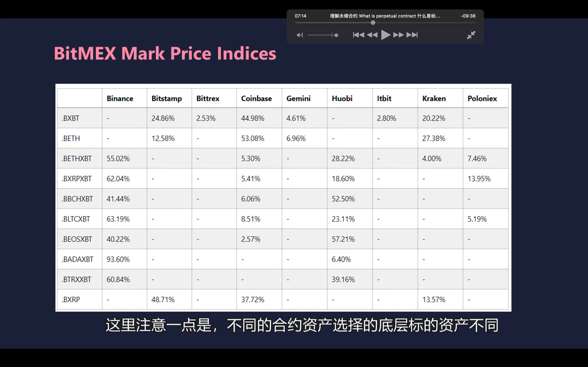</img>  
aaap

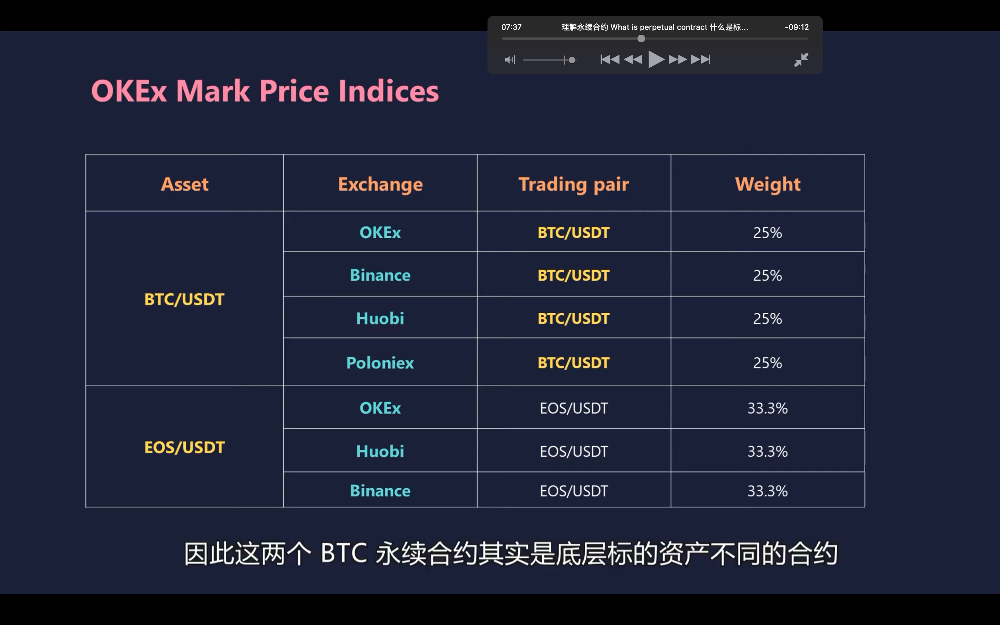</img>  
aaap，可能一个交易所选择 btc/usd，一个选择 btc/usdt 来计算标记价格

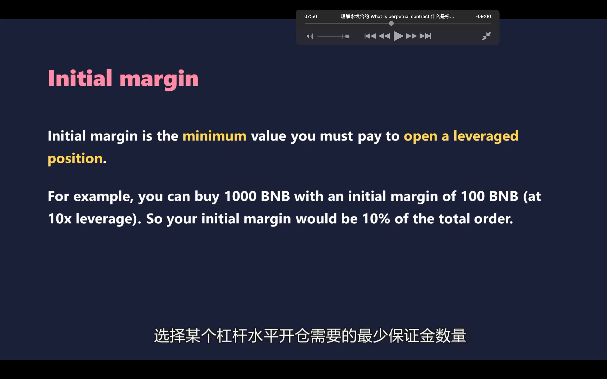</img>  
初始保证金是指 aaap，大概等于开仓量处以杠杆倍数

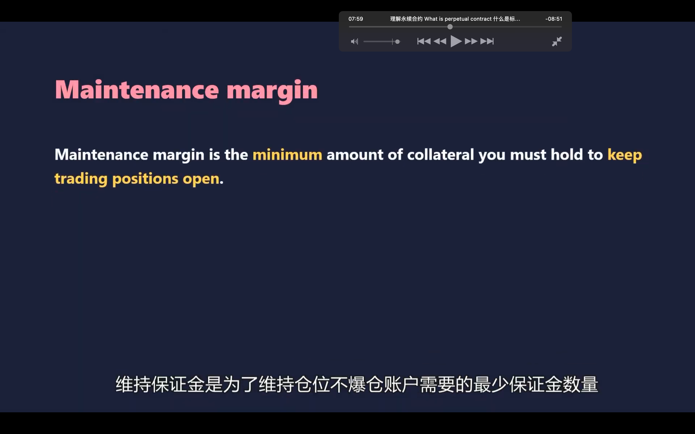</img>  
aaap，到达这个值后会强制平仓即爆仓，维持保证金会随着市场价格和交易者账户余额动态变化

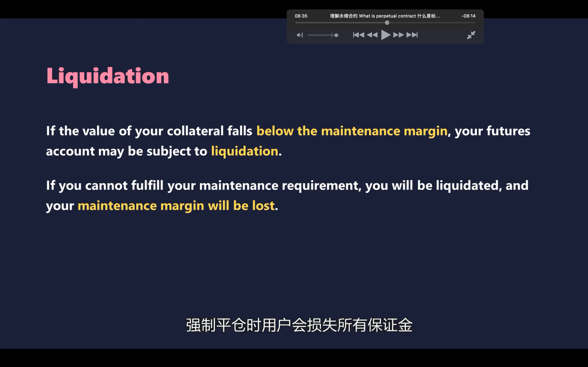</img>  
aaap，交易所还会收取额外手续费，有时强制平仓价不等于爆仓价，也就是保证金不一定完全等于平仓费，可能有盈余，可能不足以 cover 对手方的利润，这时就要用到保障基金机制。如果有盈余，则将盈余存入保障基金池子。  
如保证金余额都不足以 cover，大部分交易所会触发自动减仓机制，即强制平仓盈利方的部分仓位。最高杠杆获得最高利润的用户将优先自动减仓。

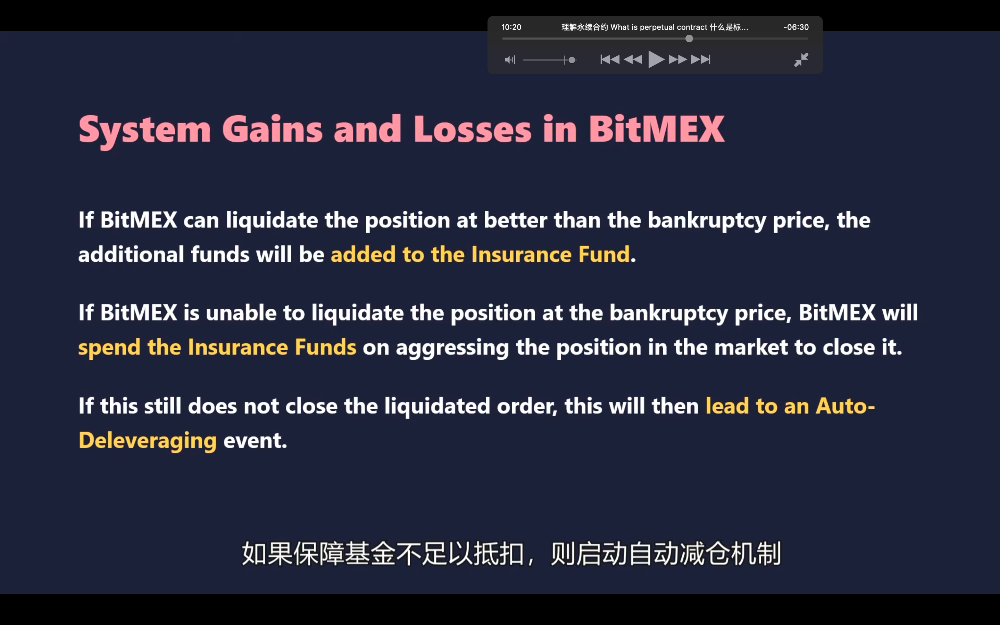</img>  
总结上面说的几段话

</img>  
资金费率  
因为永续合约没有到期日，交易所靠资金费率调整合约价格不偏离标的资产价格  
资金费率是在交易双方之间支付。交易所并不收取  
资金费率为正，多方也就是合约买方要支付空方也就是合约卖方。为负，则相反。  
资金费率 8 小时结算一次，utc 4 12 20，只有在这个时间有仓位的用户才需要支付或收取费用  
资金费用=当前持仓量\*资金费率

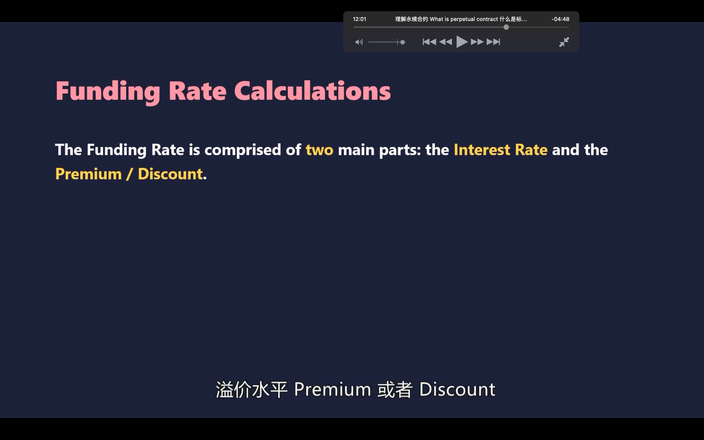</img>  
1200-1300  
更多资金费率相关信息，较复杂，省略

</img>  
pnl，profit and lost。  
分为已实现盈亏和未实现盈亏，持有仓位则是未实现盈亏，且随市场价格变化。平仓后则是已实现盈亏。  
未实现盈亏以标记价格计算，通常以未实现的亏损决定是否强制平仓，所以要用公平价格计算未实现盈亏。  
平仓价格是合约市场成交价格，所以已实现盈亏以成交价计算，与标记价格无关。  
总结就是爆仓看标记价格，自己平仓以实际价格结算。

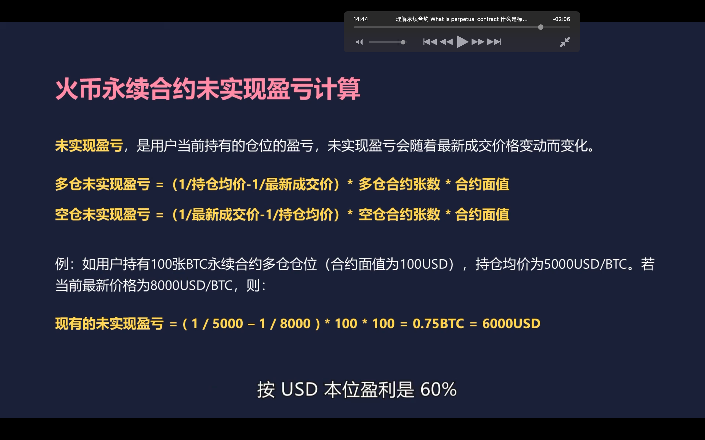</img>  
示例计算，最终 btc 本位盈利 37.5 趴，usd 本位 60 趴，所以看涨一个币，想做多，最好是用反向合约。

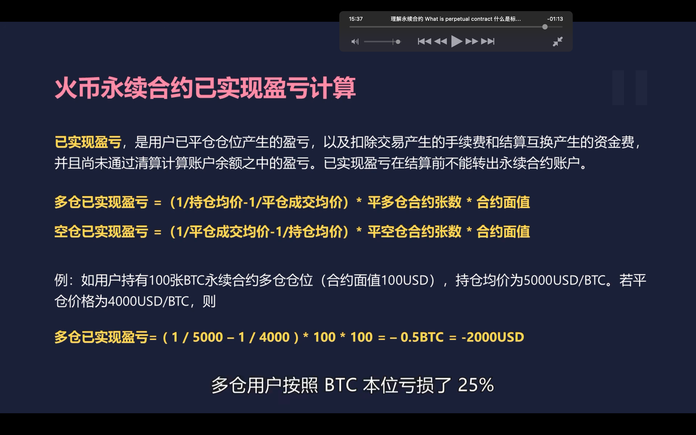</img>  
示例，如果多仓用反向合约但失败，则损失更严重

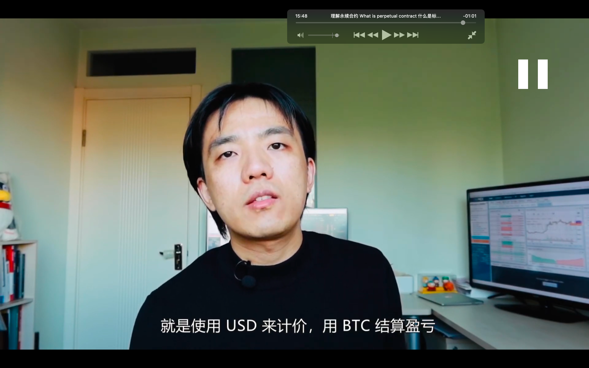</img>  
反向合约本质，用 usd 计价，btc 结算盈亏
