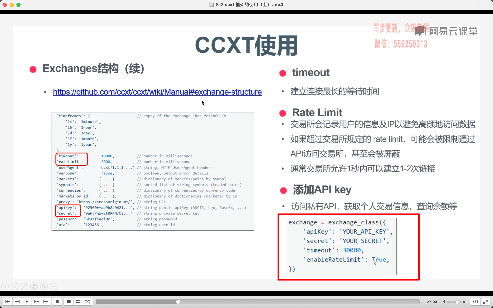
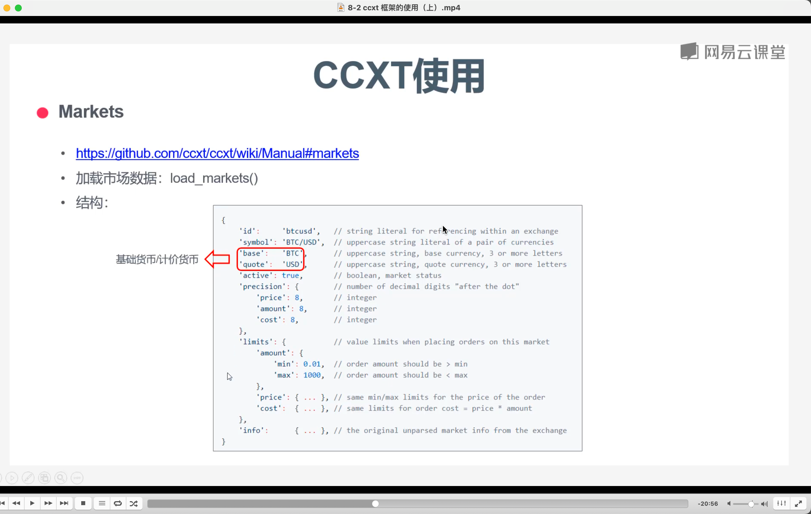
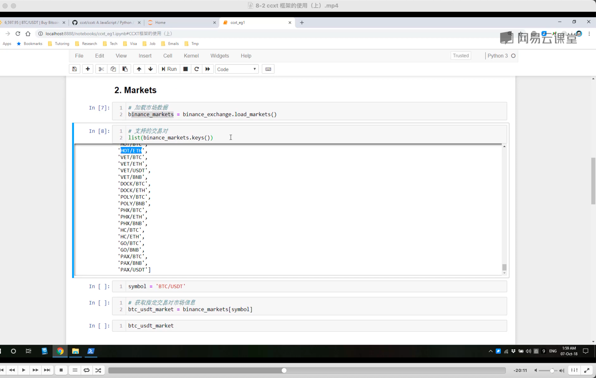
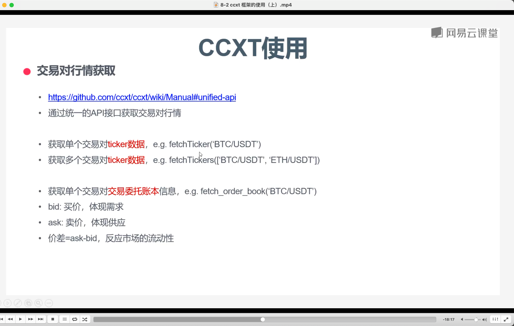
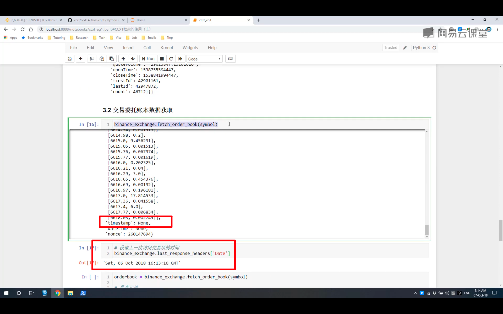
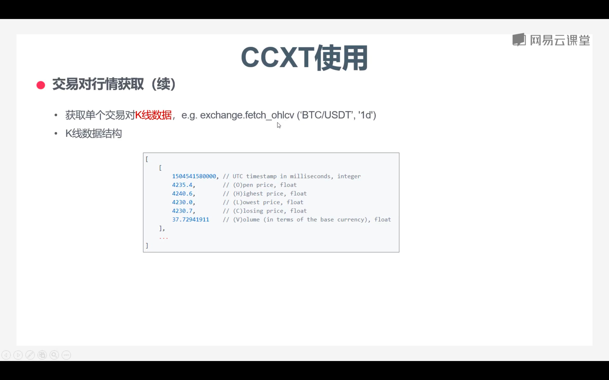
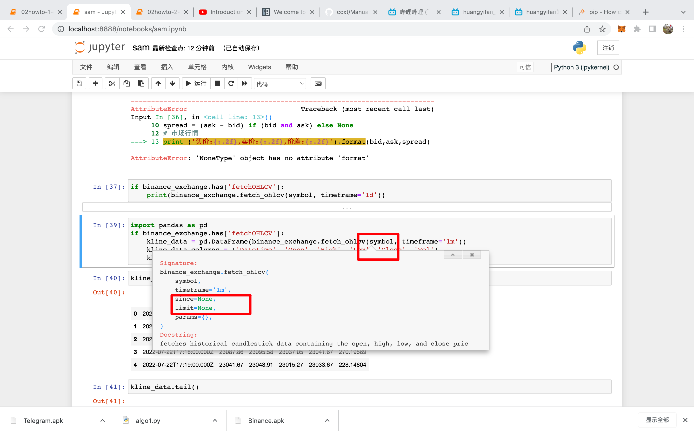
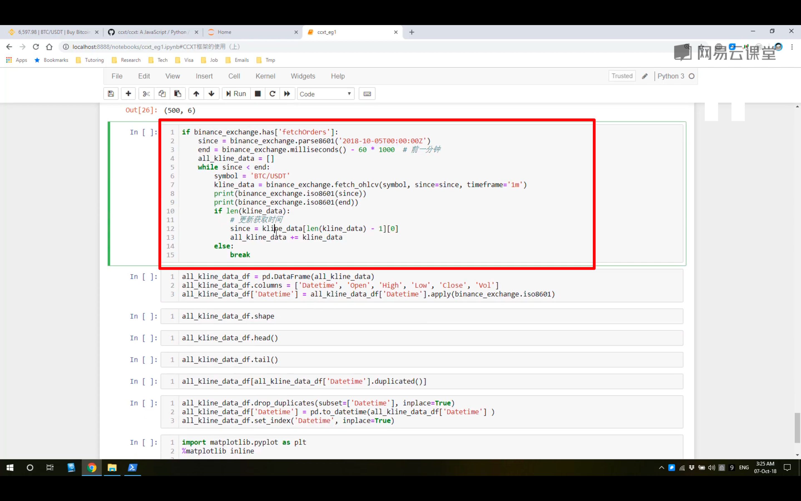

  
初始化
  

markets
  
ticker 交易对行情获取,驼峰,下划线,都没问题  
orderBook 交易委托账本

  
获取账本有些交易所获取不到 ts,则用下方的 api 获取

  
获得 k 线数据

  
imp,在此处代码 shift tap,可以看到很多细节,如函数默认参数.可以看到这里能够填写 since 参数

  
通过循环的方法,获得超过 500 个时间段段数据.
