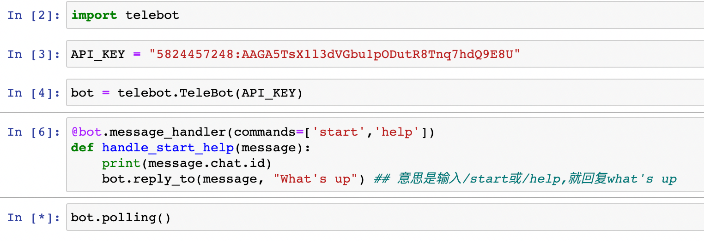

## 221211

https://www.youtube.com/watch?v=drvyh8x4egU

telegram 搜 botfather，注意要带 ✅ 才是官方的，点击 start，newbot。输入 botname，再输入 username，username 必须以\_bot 结尾。之后产生 apikey，复制下来。

使用此 python 连接 telegram 的模块，不是官方但是简单好用  
https://github.com/eternnoir/pyTelegramBotAPI

pip install pyTelegramBotAPI

</img>

再在 tl 搜索之前创建的机器人的 username。再输入/start 或/help,就回复 what's up。

## 以上只是个简单的 hello world 程序。更多细节的代码参考视频之后的内容和作者的库

https://github.com/mikolaje/TradingTutorial
