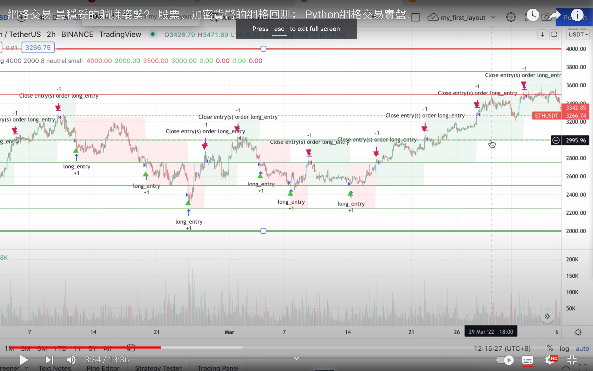
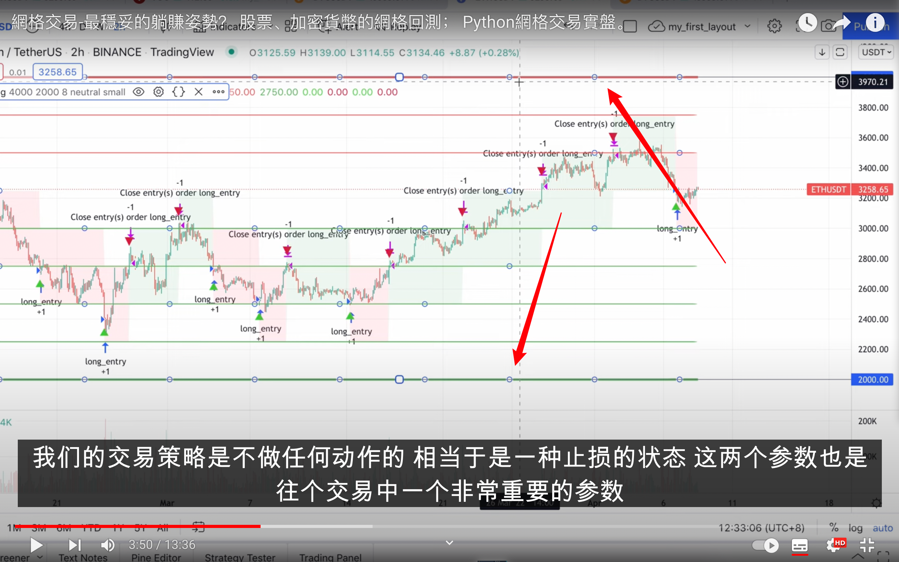
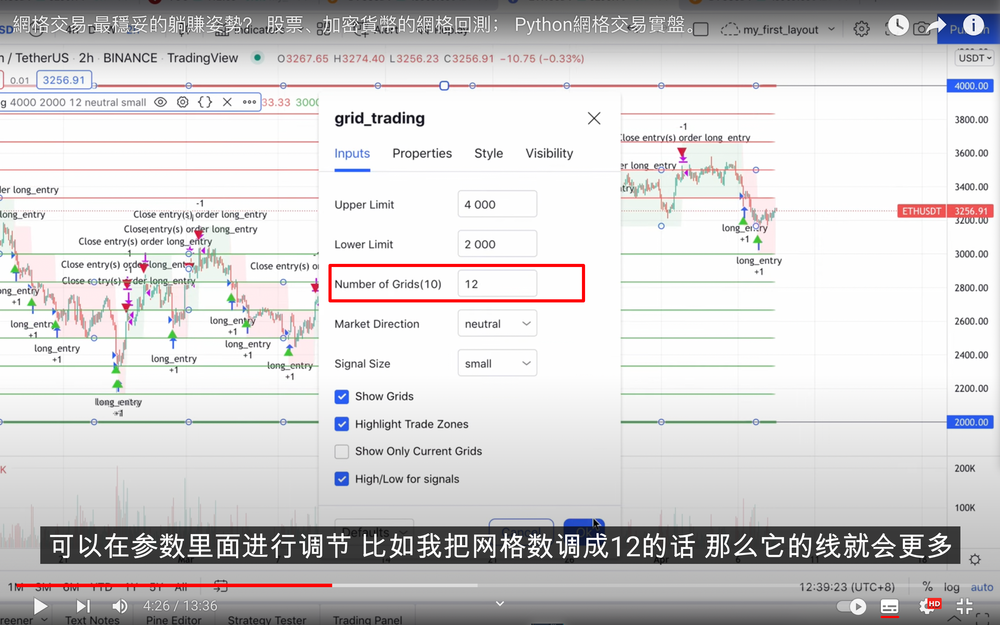
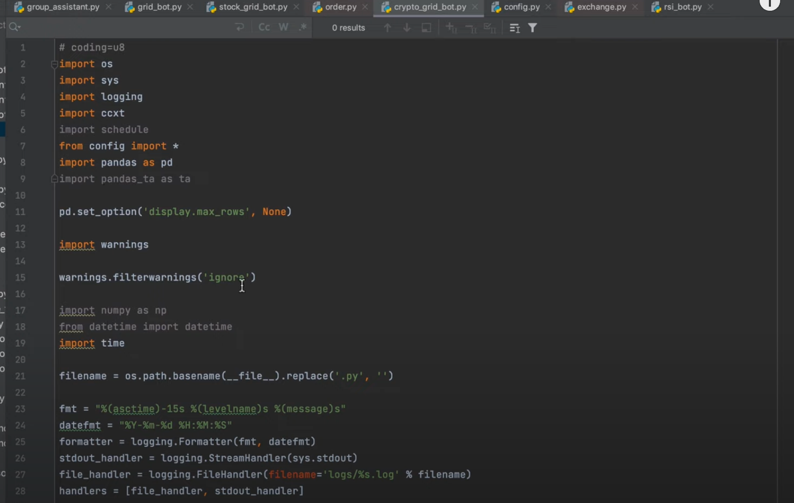
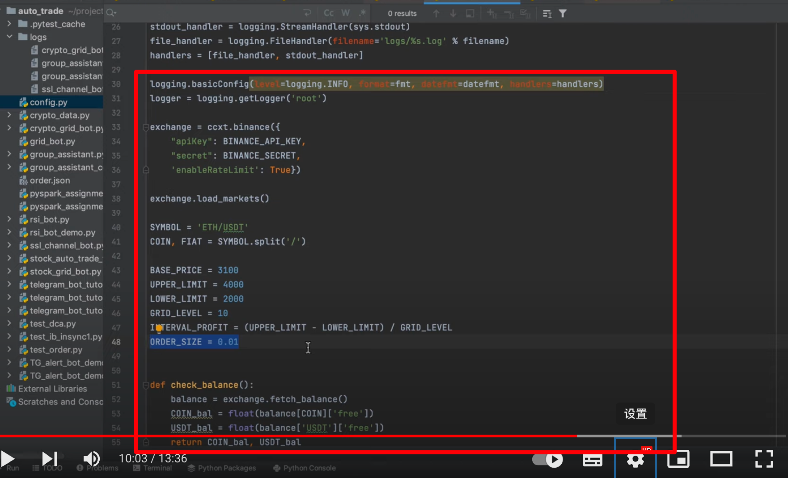
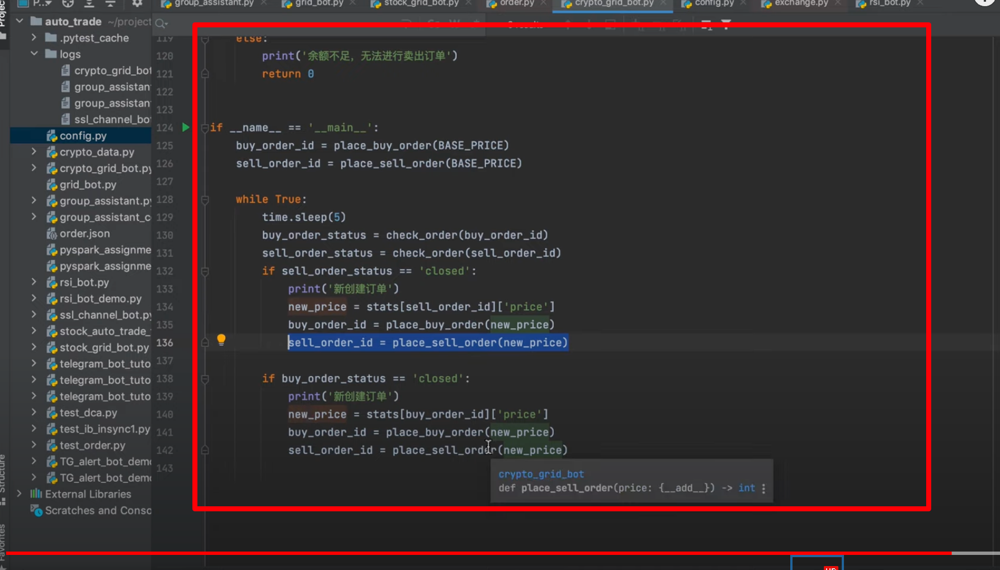

## 221220

https://www.youtube.com/watch?v=St1TKeFZFqQ

</img>  
中枢价格，做网格前买入的价格。  
比如此例，3000 价格持有 10 个以太

</img>  
设定两个线 uper limit，lower limit，超过后将不做任何交易。

</img>  
网格数量  
网格 grid

### 在中枢价格上方的每个网格线卖出一部分，在中枢价格下方的每个网格线买入一部分。

</img>  
--=  
</img>  
--=  
</img>  
交易代码，视频没显示完全
