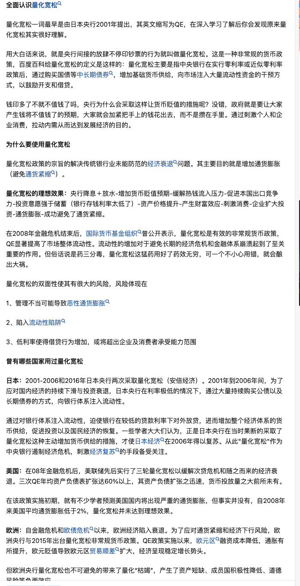

## 230416 请问量化宽松是什么意思

根据您的问题，我认为您想了解量化宽松的含义。量化宽松是一种货币政策，通常由央行实施，旨在通过增加货币供应量来刺激经济增长。这通常通过购买政府债券等资产来实现，从而增加银行的储备金，使银行能够向企业和个人提供更多的贷款。这种政策的目的是降低利率，促进投资和消费，从而刺激经济增长。

add230604  
</img>  
https://www.zhihu.com/question/35564947

## 除了购买政府债券外，还有哪些方式能增加货币供应量呢？

根据您的问题，除了购买政府债券外，央行还可以通过以下方式增加货币供应量：

- 通过向商业银行提供贷款来增加银行的储备金
- 通过降低银行的储备金要求来增加银行的可贷款额度
- 通过降低央行利率来鼓励商业银行向企业和个人提供更多的贷款

以上是一些常见的货币政策工具，央行可以根据经济形势和政策目标来选择使用。

如果您需要了解更多关于货币政策的信息，请参考您所在国家的央行官方网站或相关的经济学教材。

## 利息 interest 和利率 interest rate 的区别

根据您的问题，利息和利率是两个不同的概念。利息是指借款人向贷款人支付的费用，通常以百分比形式计算。利率是指贷款的费率，通常以年利率的形式表示。因此，利率是决定利息的因素之一。

在金融领域，利率通常用于描述银行向客户提供贷款的费率。央行利率是央行向商业银行提供贷款的费率，也是货币政策的重要工具之一。央行利率的变化会影响商业银行的贷款成本和可贷款额度，从而影响整个经济的贷款和投资活动。

如果您需要了解更多关于利息和利率的信息，请参考相关的金融学教材或咨询专业人士。

```
# 百度
利率和利息的区别主要有：
1、定义不同。
利率，是一定时期内利息额与借贷资金额即本金的比率，通常用百分比表示。根据计量的期限标准不同，表示方法有年利率、月利率、日利率。
利息，指货币持有者（债权人）因贷出货币或货币资本而从借款人（债务人）手中获得的报酬。或者说是因存款、放款而得到的本金以外的钱。
2、计算公式不同。
利息率＝利息／（本金x时间）×100%。
利息计算公式是：利息＝本金×利率×时间。
总之，利率就是一个比例；而利息是一个具体货币量。利率是单位货币在单位时间内的利息水平。
```

### 市场利率与基准利率的区别

市场利率与基准利率的区别主要是制定者不同。市场利率是反映公允的，是由各商业银行推出的，主要适用于吸收存款和发放贷款时的各个银行各自的利率，而基准利率是由中央银行指定的，同时规定各银行制定的利率不得高于基准利率的多少倍，是指导、调控整个市场的一个核心手段。

## 银行储备金是什么意思

银行储备金是指商业银行在央行开立的账户中的存款，也称为银行准备金。银行储备金是商业银行的一项重要负债，用于支付客户的存款和其他债务。央行可以通过调整银行储备金要求来控制银行的贷款额度和货币供应量，从而影响整个经济的贷款和投资活动。

```
“银行储备金一般是指存款准备金，除了存款准备金还有坏账准备金等。银行储备金是银行为应付日常需要准备的资金，商业银行的准备金存在中央银行，一部分是法定的，叫法定准备金，商业银行基本上不能用；超过部分叫超额准备金，是商业银行可以使用的；商业银行也可以将一些资金存入其他行。如果商业银行的准备金不足，可以在货币市场上向中央银行、其他银行借入准备金。”
```

## 230417 请说明央行 central bank 和商业银行 commercial banks 的关系

央行和商业银行的关系是央行是银行业的监管者和监督者，而商业银行是向客户提供金融服务的实体。央行负责制定和实施货币政策、发行货币、监管银行业、维护金融稳定，设定利率、管理货币供应量，并监督商业银行的运营。商业银行则是向客户提供存款、贷款和投资服务等一系列服务的金融机构。商业银行受央行监管，必须遵守其规定和法规。在它们的关系方面，商业银行依赖央行提供流动性和资金。央行向商业银行提供贷款和其他形式的融资，以确保它们有足够的资金满足客户的需求。商业银行还在央行持有账户，用于与其他银行结算交易。总之，央行和商业银行之间有一种共生关系，央行监管和监督银行业，商业银行向客户提供金融服务。商业银行依赖央行提供资金和流动性，而央行则依赖商业银行来实施其货币政策。

## 230417 请介绍美联储

美联储，也称为联邦储备系统（Federal Reserve System），是美国的中央银行。它由国会于 1913 年创建，旨在为国家提供更安全、更灵活、更稳定的货币和金融体系。美联储负责实施货币政策、监管和监督银行和其他金融机构，并维护金融体系的稳定性。

美联储由 12 个地区联邦储备银行组成，每个储备银行负责一个特定的地理区域。这些储备银行由华盛顿特区的理事会监督，该理事会负责制定货币政策和监督联邦储备银行的运营。

美联储实施货币政策的主要工具是联邦基金利率，即银行之间隔夜借贷的利率。通过调整联邦基金利率，美联储可以影响经济的借贷和消费水平，从而影响通货膨胀和就业。

除了货币政策职责外，美联储还负责监管和监督银行和其他金融机构。它通过多种方式实现这一点，包括定期检查银行的财务状况、制定资本要求和执行消费者保护法律。

总的来说，美联储通过促进价格稳定、充分就业和金融稳定，在美国经济中发挥着至关重要的作用。如果您有任何进一步的问题，请告诉我！

```
# 使用美联储的利率政策来影响经济的示例
if inflation > 2.0:
    fed.set_interest_rate(0.25)
elif unemployment < 4.0:
    fed.set_interest_rate(0.5)
else:
    fed.set_interest_rate(0.75)
```

### 为什么说美联储是私人的不是政府的？

根据美国联邦储备系统的官方网站，美联储是一个独立的政府机构，其目标是为美国的经济和金融系统提供稳定性和可持续性。虽然美联储是由国会授权成立的，但它的管理结构是由私人银行家和政府官员组成的。这些私人银行家被选为各个地区联邦储备银行的董事会成员，而政府官员则组成了美联储理事会。这种结构旨在确保美联储能够独立地制定货币政策，而不受政治干预的影响。

因此，虽然美联储是由政府授权成立的，但它的管理结构是由私人银行家和政府官员组成的，这使得它既有政府机构的特点，又有私人机构的特点。总的来说，美联储是一个独立的政府机构，其目标是为美国的经济和金融系统提供稳定性和可持续性。

### 美国的利率是由美联储的哪些人决定的？

根据美联储的官方网站，美联储的货币政策由联邦公开市场委员会（Federal Open Market Committee，FOMC）制定和执行。FOMC 由七名来自美联储理事会和五名来自地区联邦储备银行的联席会议成员组成。其中，纽约联邦储备银行永久担任一名联席会议成员，其余四名地区联邦储备银行的联席会议成员每年轮流更替。FOMC 的主要职责是制定货币政策，包括决定联邦基金利率的水平。因此，美国的利率是由 FOMC 的成员决定的。

## 230417 美元指数是什么意思

美元指数是一个衡量美元相对于一篮子其他货币的指数。它通常由美元对欧元、日元、英镑、加拿大元、瑞士法郎和瑞典克朗的汇率计算得出。美元指数的变化可以反映出美元在国际市场上的强弱。如果美元指数上涨，意味着美元在国际市场上更加强劲，而如果美元指数下跌，则意味着美元在国际市场上更加疲软。

## 230418 新发行的人民币是怎么一步一步流入市场的？

新发行的人民币是通过以下步骤逐步流入市场的：

1.中国人民银行负责发行人民币，他们会根据货币政策制定计划，决定发行的数量和时间表。

2.中国人民银行向商业银行发放新钞票和硬币。商业银行在收到这些新钞票和硬币后，会将它们分配给各自的分支机构。

3.分支机构会将这些新钞票和硬币分配给其它商业银行或向公众发放。

4.公众可以通过向银行存款、提款或汇款等方式获得新发行的人民币。

5.商家和个人可以将新发行的人民币用于购买商品和服务，从而进入市场流通。

总之，新发行的人民币通过商业银行和公众之间的交易逐渐流入市场。

## 中国人民银行向商业银行发放的新钞票和硬币，会算作商业银行对中国人民银行的负债吗？

是的，中国人民银行向商业银行发放的新钞票和硬币会被视为商业银行对中国人民银行的负债。

在现代货币制度中，货币是由中央银行发行并受到政府支持的，商业银行则通过从中央银行借入货币来满足其客户的需求。因此，商业银行持有的新钞票和硬币被认为是商业银行对中央银行的负债，而商业银行的存款被认为是中央银行对商业银行的负债。

这意味着，商业银行必须支付利息和偿还借入的新钞票和硬币，同时也能从中央银行获取利息和还款。这是现代货币制度中货币的基本运作原理之一。

## 230426 北向资金

在中国股市中，一般“北”指的是沪深两市，“南”指的是香港股市。因此，北上资金就是指从香港股市中流入大陆股市的资金，同时内地也有流入香港股市的资金，而这个资金被称为南下资金。

和北上资金对应的是南下资金，这里的南北不是我们平常所说的南方和北方，而是参照的香港的，北上资金是进入 A 股市场中的香港资金以及国际资本，南下资金则是进入港股操作的中国内地的资金。这两种资金名称是在我国开通沪港通以及深港通开通互通互联之后形成的。

在 A 股市场中，是不允许国外的资金进行直接参与，该市场的资本市场是受到管制不能够实现自由流通的。我国香港股市市场是国际化金融中心，很多国外的资金可以在港股中进行投资，而我国在分别在 2014 年和 2016 年开通的沪港通和深港通开通了 A 股市场和港股市场中的资金互流，因为内地在香港的北面，就形成了北上资金的说法。

## 什么是在岸人民币？什么是离岸人民币？

作者：Dickson
链接：https://zhuanlan.zhihu.com/p/29172414
来源：知乎
著作权归作者所有。商业转载请联系作者获得授权，非商业转载请注明出处。

在岸人民币

央妈授权中国外汇中心于每个工作日上午对外公布当日人民币兑换美元、欧元、日元、港币汇率的中间价作为当日银行间即期外汇市场以及银行柜台交易汇率的参考价格，这就叫在岸人民币。

离岸人民币

央妈开放香港以及其他国家进行人民币交易的汇率就叫离岸人民币，而 2010 年中国香港实施的人民币离岸交易（CNH）已经是泛指海外离岸人民币交易。被绕晕了？简单来说就是一个是在国内换汇的汇率，一个是在国外换汇的汇率。在岸人民币市场发展的时间比较长、规模比较大、受到的管制也比较多，在岸汇率受到央妈政策影响比较大。而离岸则相反，他的汇率变化主要是受到国际因素影响比较多，通常离岸人民币市场更能充分反映市场对人民币供需。虽然看是两个市场，但他们也是会相互影响的当离岸比在岸弱的时候，也就是国内换 1 美元要花掉 6.5 人民币，香港换 1 美元要 7 人民币，那么出口商就会倾向于在离岸市场交易，因为赚回来的美元可以换更多的人民币。这个过程，出口商在离岸市场卖出美元，买入人民币就会令离岸人民币升值。相反地进口商就会倾向于在岸交易，因为可以换更多的美元出去买东西。这个过程中，进口商在在岸市场买入美元，卖出人民币就会令在岸人民币贬值。另外，虽然两个市场不能进行直接套汇交易，但是可以在无本金交割远期外汇交易（NDF）市场进行套汇，只要存在价差，就会高卖低买，影响两个市场的人民币汇率趋向一致。

## 230501 信托是什么意思

信托是一种法律关系，由委托人将财产或权利交给受托人管理，受托人按照委托人的要求或者信托文件的规定管理和处置财产或者权利，最终将收益或者财产交还给受益人的一种制度。信托可以用于财产管理、遗产规划、慈善事业等领域。

家族信托是一种特殊的信托形式，它是由家族成员建立的，旨在管理和保护家族财富。家族信托通常由家族成员担任受托人，他们负责管理信托基金并确保其按照信托文件的规定进行管理。家族信托可以为家族成员提供财务保障和避税优惠，并确保家族财富在多代之间得以传承。需要注意的是，家族信托的设立需要遵守当地的法律法规，并且需要谨慎考虑信托文件的具体规定，以确保信托的合法性和有效性。

## 信贷和贷款的区别

大概可以理解为信贷是无抵押贷款

范围不同：信贷仅指无担保贷款，即借款人在申请贷款时无需提供抵押担保，凭借个人信用向贷款机构申请贷款；贷款范围更广，包括抵押贷款和无担保贷款；  
风险不同：因为信贷是无抵押释放的，贷款机构承担的风险更大；贷款涉及抵押贷款，也就是说借款人办理抵押贷款时，需要提供符合贷款机构要求的抵押物。在这种时候，贷款机构承担的风险会小得多；  
贷款利率不同：与抵押贷款相比较，信贷的利率要高得多。

## 信贷利差是什么

个人理解，信贷利差就是金融机构获取资金和发放贷款收获利息之间的利率的差值

## 大宗商品是什么意思

大宗商品是指交易量大、规模大、流通性强的商品，例如石油、黄金、铜、铁矿石等。这些商品通常用于工业生产或投资目的。在交易市场上，大宗商品通常以标准化合约的形式进行交易，这些合约规定了商品的数量、质量、交割时间和交割地点等细节。大宗商品市场是全球最大的市场之一，对全球经济和金融市场具有重要影响。

## 230503 cpi ConsumerPriceIndex

CPI 一般指消费者物价指数。 是反映一定时期内城乡居民所购买的生活消费品和服务项目价格变动趋势和程度的相对数，是对城市居民消费价格指数和农村居民消费价格指数进行综合汇总计算的结果

简单来说就是消费品物价指数。

cpi 升，物价涨，就加息降低物价，加息了就从币圈吸钱，币价跌。

## 货币互换协议

中国给俄罗斯一定额度人民币，俄罗斯给中国一定额度卢布， 协议期间俄罗斯用了人民币还钱时还同样多的人民币，中国用了卢布归还时还同样多的卢布，所以货币互换不涉及到汇率的上下浮动问题因为用什么货币就会归还什么货币，是便利国际贸易的常用金融手段让贸易双方规避了汇率变动的风险。中国和韩国日本土耳其等等很多国家也签有货币互换协议，美国和很多国家也签有很多货币互换协议，不存在谁占谁便宜的问题。

货币互换到期的时候，双方需要再换回各自的货币。由于卢布对外大贬值，比如贬值一半，那么我们就可以用一半的人民币去市场买卢布，到期时，用这批卢布换回之前完整的人民币。 这就是互换的好处，谁的货币贬值，其实是自己承担损失（当然前提是到期时，双方如约执行了互换回货币）。同时因为没有美元这个中间商，双方都省了一笔汇率损耗（如提现费，如手续费，如到银行换美元是在岸价等）

## 结汇是什么意思?

结汇是外汇结算(exchange settlement/foreign exchange settlement)的简称 分为:个人结汇与公司结汇目前国内多家银行都可以办理，但是一年只能有 5 万美金额度。

结汇是指外汇收入所有者将其外汇收入出售给外汇指定银行外汇指定银行按一定汇率付给等值的本币的行为。结汇有强制结汇、意愿结汇和限额结汇等多种形式。举个例子，中国出口企业向者外卖出一批货物，国外买家外用美金付款，那么这家中国的出口企业把收到的美金兑换成人民币，这个过程就称为结汇或外汇结算。

## 流动性宽松是什么意思

流动性宽松是指央行采取一系列措施增加货币供应量、降低利率、扩大信贷等，以促进经济增长和应对经济危机。这样做可以使银行更容易获得资金，并降低借贷成本，从而刺激消费和投资，增加就业机会。

## 逆周期是什么意思

逆周期是指在经济下行周期中，政策措施对冲经济衰退所产生的负面影响的一种调控方式。在经济下行时期，政府会采取一系列财政和货币政策措施来刺激经济增长，增加就业机会。这些措施包括减税、增加政府支出、降低利率、加大货币供应等，以逆转经济下行的趋势，促进经济复苏。逆周期政策的目的是在经济高峰时期抑制过度增长，以及在经济低谷时期提供支持。

## 蓝筹是什么意思

蓝筹是指在某个特定行业中具有稳定、长期盈利能力和业绩优良的大型上市公司。蓝筹股通常具有较高的市值、流动性和广泛的业务范围，是市场上相对安全和稳定的投资选择，被视为优质股票。蓝筹股的表现通常可以反映整个行业或市场的走势，因此在股市投资中占有重要地位。一般来说，蓝筹股的股价相对稳定，股息收益率相对较高，对于投资者来说是一种相对低风险的投资选择。

## ppi 是什么意思

PPI 是指生产者物价指数(Producer Price Index)，是用于衡量生产者所售出商品和服务价格的指标。PPI 通常被用作衡量通胀的指标之一，以反映生产活动中的物价变化情况。PPI 包括所有工业品、农业产品和能源产品等，衡量的是生产环节的价格变化，是反映生产成本的指标。与 CPI（居民消费价格指数）不同，CPI 反映的是消费者购买商品和服务的价格变化，而 PPI 则反映了生产环节的价格变化，因此 PPI 在经济中的作用是预测 CPI 的走势和衡量通胀压力。

## ADP 就业人数

ADP 实质上是美国人口数据的缩写,所以 ADP 就业人数实质上表示的就是美国就业人数数量

## 230505 资产负债率

表示的是一个公司中，有多少钱是通过负债获得的，负债占总资产的比例。

比如你打算开一家商店，自己准备了 10 万，又向银行借了 5 万，那么你开商店的总资产=负债+所有者权益=15 万，资产负债率=总负债/总资产=5/15=33%。

## 230506 股权溢价指数

从数学抽象上讲，就是上市公司赚了多少钱，它全部分给你的分红率是多少。我们用这个分红率去减去十年期国债的收益率。我们管这个东西叫股权溢价指数。

这个指数越高，市场在底部区域的概率就越大。一般来讲，沪深 300 这个指数，它的股权溢价指数超过 6%，就很有投资价值了。

## 230507 债券

债券其实就是企业找投资者借钱，所开的欠条，约定时间还本金，并约定利率，还多少利息，借钱期限多久。

## 一级二级市场，以债券为例

一级市场就是发行人市场，卖方就是债券的发行人，如政府债券的一级市场，卖方就是政府；买方则主要是各大商业银行与投行，或是符合条件的个人投资者。买卖方式是以竞拍的方式，价高者得。

二级市场，任何人都可以做卖方，只要他持有债券，就可以在二级市场抛售，同时任何人都可以做买方。买卖方式是以撮合成交的方式。

## 证券是什么

所有能够在未来为你带来资金(或高流动性的实物)流量的票据都是有价证券。如果我和签一张合同，约定你现在给我 100 块，之后我每个季度给你一个大苹果，那么这份合同就是一个有价证券！

常见的有：

股票：股息收入+资本利得 一般在政府指定的证券交易所（上交所）交易，也有场外交易（如中小企业股权转让）

债券：资本利得+利息收入 一般在政府指定的证券交易所

存单：利息收入 一般在银行间市场交易

比较复杂的有：期权、期货、权证、远期、互换等（也就是各种衍生品，也很常见）

期权期货互换一般在政府制定的交易所交易（如大连商品交易所、芝加哥商品交易所、香港证券交易所等），权证、远期多在场外交易

除此以外还有：基金、仓库提货单、房产证、保函、抵押合同等等，都可以认为是有价证券，越是流动性低的有价证券，交易费用越高，交易成本越大，交易对手越少。

## 230508 非标债和标准债的区别

1.参与主体不同。标准化债券是由证券公司或银行承揽/承销，在上交所、深交所或银行间市场发行的债券业务，主要参与主体为银行、险资、公募基金等金融机构。非标债类融资是信托、保理、融资租赁公司等企业为城投服务发行的债类贷款行为，主要参与主体是个人投资者。

2.国家支持程度不同。标准化债券市场为政府强调的不发生系统性金融风险的实质市场。因融资成本低、存续期限长的优势，中国所有银行、险资等金融机构资金都参与到该市场投资。不到万不得已各类企业不会在该市场公开违约，因为影响太大，这基于国家反复强调不可以发生系统性金融风险的底线要求。

3.监管与专业程度不同。非标市场相对简单与独立，没有统一的标准与监督，投资门槛较低。标准化市场是专业投资市场，投资门槛高，且债券发行条件和额度是受到监管和限制的。另外，每支债券的发行，由券商、银行等金融机构进行更加严格、全面的前期尽调及投后监控，确认发行方有意愿更有能力按期兑付，把控风险；而非标产品的风控，肯定不及标债，我们更应该参于到专业市场的投资，因为专业市场更加稳定，出错概率更低。

## 什么是信托

信托---“受人之托，代人理财”。他是由信托公司发行的，收益率和期限固定的理财产品，融资方通过信托公司向投资者募集资金，并通过资产抵押给信托公司以及第三方担保保证本金收益如期兑付。

在我国市场，有许多人需要借钱，称为「融资方」；有许多人有钱，想借给别人收点利息，称为「投资人」。信托就是一种金融工具，通过信托，「融资方」和「投资人」可以建立合法合理的有保障的「借贷」关系。

信托有以下特点：

1. 「融资方」的金额比较大，例如 1 亿元；「投资人」的金额比较小，例如 100 万元（散户）；如果「投资人」为银行等机构的话，也是比较大的；

2. 借多少时间是固定的，还钱的时间不能早也不能晚；

3. 收益大概在 9%~10% 之间，且为固定收益；

4. 如果「融资方」不还钱，这钱需要信托公司还（刚性兑付），这种特性未来可能会消失；

我国信托公司只有 68 家，和银行、保险、证券同为国家的四大金融机构。信托和银行受银监会监管，证券受证监会监管，保险受保监会监管，银行和信托发行的理财产品都是需要银监会批准后才能发行。

信托公司是有金融牌照的，国内的信托公司大多数都是国有控股。

## 230510 再融资

再融资是指企业通过向市场发行股票、债券等证券来获得额外的资金。这种融资方式通常被用于企业扩张、重组、还债等需要大量资金的场合。

再融资可以通过向公众发行股票或债券等证券进行，也可以通过私募方式向特定投资者募集资金。企业可以通过发行股票来增加股本，也可以通过发行债券来借入资金。在再融资过程中，企业需要向投资者提供详细的财务信息和业务计划，以吸引投资者购买其证券。

## 国库券和国债有区别吗

国债和国库券都是政府发行的债务工具，但它们之间有一些区别。

国债是政府向公众发行的长期债务工具，期限通常在 1 年以上。国债的利率相对较高，因为它们通常面向长期持有者，如退休基金、保险公司和长期投资者。国债还可以通过证券市场进行交易，因此具有流动性。

国库券是政府向公众发行的短期债务工具，期限通常在 1 年以内。国库券通常用于短期融资，如政府运营资金的周转。由于国库券期限较短，其利率相对较低，但它们通常被视为较安全的投资选择。国库券也可以通过证券市场进行交易，因此也具有流动性。

总之，国债和国库券都是政府发行的债务工具，但它们之间的主要区别在于期限和利率水平。国债通常面向长期投资者，期限较长，利率较高；而国库券通常用于短期融资，期限较短，利率相对较低。

## 230511 基点

基点是指衡量债券或期票利率变动的最小计量单位,1 个基点等于 0.01%,即 1%的百分之一

## 230513 展期

展期是指借款人在贷款到期日无法按时还款时，与借款机构达成协议，将原有贷款到期日延长一段时间的行为。

展期通常会导致借款人需要支付额外的费用，例如利息、罚款等。借款机构可能会根据借款人的信用状况、贷款余额和市场利率等因素来决定是否同意展期，以及展期期限和费率等具体条件。

展期可以帮助借款人暂时缓解经济压力，给予其更多时间来筹集还款资金。然而，如果借款人无法及时偿还展期贷款，可能会面临更高的利息和罚款，甚至可能导致信用评级下降，从而对其未来的借款活动产生负面影响。

在借款时，借款人应该尽可能避免需要展期的情况。这可以通过合理规划还款计划、保持充足的流动资金储备、寻找额外收入来源等方式来实现。

## 230514 破产保护

破产保护是一种法律程序，旨在帮助无法偿还债务的个人或公司重新组织或清算其债务。破产保护通常由法院监督，旨在保护破产方免受债权人的追债和强制清算。

在个人破产保护中，破产人通常会提交一个“破产申请”，以寻求法院的保护。法院可以下令停止债权人的追债行动，并对破产人的债务进行重新组织或清算。这可以让破产人暂时免除债务或降低债务负担，并在未来的时间内还清债务。

在公司破产保护中，公司可能会提交一个“破产申请”，以要求法院保护。公司可以利用这个机会重组公司，并在清算部分债务后重新开始经营。如果公司无法重新开始经营，法院可以下令强制清算公司。

破产保护是一个复杂的程序，需要专业的法律和财务知识。如果您正在面临破产风险，建议寻求专业意见以了解您的选项和最佳做法。

```
破产保护说白了是企业进入破产程序后，法律给予的一些保护手段，例如停息止付，解除担保等。对于一些因为一时资金链断裂但生产经营正常的企业来说，进入破产程序中反而可以得到喘息的机会（主要还是为了躲避银行的压迫），俗称破产保护。所以，你的理解和你所理解的大家的理解都有些偏颇，要取得破产保护，企业必须进入破产程序，至于企业是否能从破产程序中浴火重生（和解和重整），就不一定（方案需要得到债权人会议的同意），不能的话就是清算了。
```

## 230515 基尼系数

基尼系数是用来衡量收入或财富分配不均的一种指标。它是基于基尼系数公式计算出来的，其取值范围为 0 到 1 之间，数值越接近 1，说明收入或财富分配越不平均。

基尼系数的计算方法是：将收入或财富按照从小到大的顺序排列，然后根据 Lorenz 曲线计算出实际收入或财富分配占总收入或财富的累计百分比，再将这个累计百分比与人口比例累计百分比进行比较，最终计算出基尼系数。

基尼系数在经济学、社会学、政治学等领域有广泛的应用。它可以用来评估一个国家或地区的收入或财富分配情况，并为政府和社会组织提供有针对性的政策建议。

## 230516 mmt 现代货币理论主要观点

```
总结此理论大概是支持政府发行货币刺激经济，而较少考虑负面作用。
```

现代货币理论（Modern Monetary Theory，简称 MMT）是一种经济学理论，它认为，现代货币制度下，政府不会因为缺乏货币而无法支出，而且政府应该通过发行货币来为经济提供支持。以下是 MMT 的主要观点：

政府可以自由地发行货币，因为货币不是有限的资源，而是政府可以创造的工具。

政府在其自己的货币领域是主权的，因为政府可以决定其货币的供应量和利率，从而影响经济。

当经济处于不景气时，政府应该通过增加公共支出和减少税收来刺激需求，并通过增加货币供应量来确保经济稳定。

政府的支出不会使政府陷入债务危机，因为政府可以通过发行货币来还清其债务。

通货膨胀是货币供应量过度增加的结果，但政府可以通过调整税收来控制通货膨胀。

总的来说，MMT 认为，政府可以通过使用其货币主权来促进经济增长和维持经济稳定，而不必担心债务问题。然而，MMT 的观点在经济学界存在争议，并且实施其理论需要谨慎考虑，以确保不会导致经济不稳定。

## 230524 次贷危机

先回答什么是次级贷款？
银行(包括房利美等机构)发放的按揭贷款，按照申请人的信用水平和偿债能力，分为一系列的等级，收入高且稳定，工作光鲜的华尔街单身汉的信用等级就高；而在杂货店打工，没有稳定收入的黑人兄弟的信用等级相对较低（这里并没有歧视黑人兄弟的意思）。对于信用等级高的客户，银行给他的贷款的利率就低，也即风险溢价较低。而对于信用等级低的客户，银行不发贷或者收取较高的利率，需要保证人等等，也即风险溢价高。对于发给信用等级低偿债能力弱的客户的贷款，称为次级抵押贷款。特点是风险大，有高风险溢价，收益相对一般债券较高。

现在银行手里面握着一把贷款合同，贷款合同是没法流动的，也就是没法很方便的买卖。为了提高流动性，需要对这些次级贷款进行打包和包装，于是产生了 MBS。更通俗地说，你到银行不能买别人的贷款合同，只能买银行的理财产品，MBS 就可以认为是一种理财产品。

那么，什么是 MBS？
MBS，Mortgage Backed Security，抵押支持债券，是抵押贷款证券化的产物。现在在银行手里握着一批按揭贷款合同，这些合同会定期为银行带来一定的现金流，也就是贷款买房人的还贷。银行把这些合同打包组合成 MBS，然后再拆分成三个层级出售，优先级、次优级、次级。每次收回贷款，先保证优先级的收益，在满足优先级的收益后满足次优级，最后是次级。因此优先级期望收益率最低，风险也最低，次级期望收益率最高，风险也最大。MBS 会定期给购买者一定的回报，期满还本付息，也是一种结构化固定收益产品。此外，除了分级结构外，MBS 还通过 CDS 包装，大幅提高了 MBS 的信用评级。（CDS 将在后文介绍）信用评级机构也在这里起到了推波助澜的作用。

大家都看到 MBS 的收益率高，稳定（相对于其他产品），于是就争先恐后去买 MBS，银行的产品很快就卖完了。怎么办呢？联邦基金利率很低，银行里有大量的流动性，因此银行决定发更多的贷款，原来不给发贷的次级客户(比如刚在便利店打工半年的隔壁老王)，现在也能拿到贷款去买房了。

一开始，故事很美，银行赚中间费用，管理费和利率差，有钱的投资人拿到稳定的投资收益，穷人贷款买到了房。偶尔有几个人不还贷，因为房价一直在涨，银行把房子收回拍卖了就好，银行感觉没什么风险。

于是银行胆子越来越大，再加上利率一直在降，于是什么人来都能拿到贷款买房。原来首付 30%，还要收入证明，现在首付 5%甚至 0 首付，站在街上拍张照片就能拿到贷款。贷款买的房还能做抵押再贷款买第二套房。MBS 产品也总是销量可观，而且银行进一步开发了基于 MBS 的 CDO, aka, collateralized debt obligation。流动性过剩背景下房地产泡沫就起来了。

2005 年，突然有一天，美联储觉得房地产泡沫太大，而且这时美国经济基本复苏啦，于是联储开始不断加息，抑制通胀和经济过热。当利率上涨到一定水平，那部分次级贷款人就还不起贷款了，一方面是因为还贷压力增大，另一方面由于紧缩的货币政策降低了就业率和工资上涨。市场开始变味了，开始，只是越来越多的次级贷款违约。此时房价已经很贵了，没什么人肯接盘了，银行手里面握着一大批房子去拍卖，结果市场突然供过于求，房价急转直下。房价一跌，作为房东的你应该怎么办？赶紧卖房啊！

再说偿债能力高的客户（比如华尔街的小蒯），他们贷款 100 万刀买了套房，然后刚还了一年贷，房价突然降了 25%，原来 100w 的房子现在只值 75w 了而且看样子明年还要继续跌 50%。脑子正常的人都会觉得自己亏了。于是他们主动违约，要求银行收回房子，拒绝继续偿还贷款，即使我有能力还贷，也就是强行违约。现在银行手里的房子更多了，房价跌的更厉害了。

此时，MBS 和 CDO 所依赖的底层，按揭贷款合同，已经大面积违约，现在银行根本拿不到钱，只有一批烂在手里的房子，购买 MBS 次级产品客户首先亏成狗，然后是次优级，甚至最后连风险最小的优级也拿不到本金了。MBS 崩盘，CDO 跟着崩盘。盘子实在太大，以为掉下来的是餐盘结果是磨盘...倾一国之力都接不住，只能全世界一起完蛋……

发贷款的银行、给银行存钱的人、买 MBS 产品的机构和个人，投资 MBS/CDO 衍生产品的机构和个人突然都拿不到钱了。于是新世纪金融破产，雷曼兄弟破产，贝尔斯登破产，两房申请破产保护。

而把钱交给雷曼兄弟、两房这些机构投资的机构和个人就慌了，他们的本金没有了。

市场恐慌，市场风险承受能力骤降，所有人都开始要求收回资金，提前偿贷，整个市场一潭死水。

金融危机爆发！历史上叫做 Subprime Crisis，次贷危机。

PS. 文中提到了 CDS，那么什么是 CDS？
CDS，Credit Default Swap，信用违约掉期。名字看上去很厉害，其实可以简单理解为为投资产品设计的保险。作为握着一大笔次级贷款的银行，我很担心这些贷款大面积违约（毕竟他们中一大半人工作都不稳定，或者就是已经有了一屁股债），同时，次级贷款太多了不利于 MBS 的信用评级。为了提高 MBS 的信用评级，银行会为这些次级贷款买一些 CDS。CDS 是这样运作的，银行每年付一定的保险费，比如 0.5%，当次级贷款违约，CDS 卖方会代替违约方继续偿还贷款(一般是向银行按原价买下贷款，或者直接赔付原价与现价之间的差额，弥补银行损失)。在 CDS 的包装下，MBS 的信用评级变得非常好看，一般都是投资级；如果没有 CDS 包装，那么 MBS 就只能是投机级，也就是垃圾级。当然这是故事后期的情节，在一开始，只要是 MBS，你给钱，标普就给你 AAA 的评级，虽然 MBS 里面其实是一坨屎……

银行没有想到的是 CDS 卖方也会违约。根据一些统计数据，次级按揭贷款大概一共只发了 100 亿刀，然而 CDS 的保证额却是 300 亿刀，也就是 100 块的债券我买 3 份保险，保 300 块。如果 100 块的合同违约，我就可以获得 300 块的赔付。Naked CDS 的大量发行使得 CDS 卖方在大面积违约时根本没法赔付（类似于保险公司也会被大规模的赔付拉到破产，所以保险公司也会再保险）。这严重危害了金融稳定和市场秩序。

Naked CDS，裸 CDS。举个不大恰当的例子，就是你不坐某架飞机，然而你却买了 10 份这个航班的航空意外险，你其实就是在赌这架航班会掉下来，如果飞机真的出事儿了，你就赚大了（花 200 块，赚 300w，收益率 1500000%）。然而如果航班正常，你就把本金一毛不剩赔进去了，收益率-100%。买裸 CDS 的人也是这么想的，他们看出了 MBS 已经出问题了，于是赌 MBS 肯定会违约，如果赌对了，那么收益大概是好多倍，如果赌错了，那么本金就一毛没有了。。

## 230601 pmi

PMI 指数的英文全称为 Purchasing Managers' Index，中文意思是采购经理指数，是通过对采购经理的月度调查汇总出来的指数，能够反映经济的变化趋势。
PMI 是一套月度发布的、综合性的经济监测指标体系，分为制造业 PMI、服务业 PMI，也有一些国家建立了建筑业 PMI。PMI 指数 50%为荣枯分水线。

## 230604 请问经济学中的明斯基是什么意思

在经济学中，"明斯基"可能指的是"明斯基时刻"（Minsky Moment）或"明斯基金融不稳定假说"（Minsky Financial Instability Hypothesis）。两者都是由美国经济学家赫曼·明斯基（Hyman Minsky）提出的。

1，明斯基时刻：这是指在经济周期中，投资者对风险的忽视导致的过度借款和资产价格过高，最终导致金融系统的崩溃。当投资者和机构对风险过于乐观，债务和杠杆过高时，他们可能会遇到无法偿还债务的情况，这就是所谓的"明斯基时刻"。

2，明斯基金融不稳定假说：明斯基提出了一个理论，认为在自由市场经济中，金融危机是必然的。他的理论强调，经济的稳定会导致投资者和机构冒更大的风险，从而使系统变得不稳定。这就是明斯基的金融不稳定假说。

赫曼·明斯基的理论在 2008 年全球金融危机后得到了更多的关注，因为这场危机与他的理论有许多相似之处。

## 230622 国债逆回购

## 230623 MLF Medium-term Lending Facility 中期借贷便利

add  
也许翻译成中期借贷工具更合适？

作者：贝塔数据 BETA DATA
链接：https://zhuanlan.zhihu.com/p/625532325
来源：知乎
著作权归作者所有。商业转载请联系作者获得授权，非商业转载请注明出处。

很多人对 MLF 应该并不陌生，但是你真正了解它吗？MLF 到底是啥？为何能影响 LPR 和投资？它的利率是由谁决定的？怎么看它对投资的影响？今天，我们就来一起深入探讨一下什么是 MLF~✦ ✦MLF 是啥？MLF 是中期借贷便利，也被亲切地称为“麻辣粉”。央行每月月中会公布 MLF 的最新相关信息。很多人对 MLF 有误解，以为它的本质是利率，其实不然，MLF 是央行的一种货币政策工具，它由借款期限、借款利率和借款金额组成。以这条新闻为例，来理解下 MFL 的几部分：“央行开展 1700 亿元 MLF 操作，本月 MLF 到期量为 1500 亿元；本月 MLF 操作利率为 2.75%，期限为 1 年。”将关键信息整理如下表：（图片制作：贝塔数据）期限 1 年：就是央行把钱借钱商业银行 1 年，一年后商业银行要还钱。操作量 1700 亿元：就是指央行借给商业银行 1700 亿元钱。中标利率 2.75%：就是利息，是央行把钱借给商业银行收取的利息。本月到期量 1500 亿元：就是之前借给银行的钱有 1500 亿元到期了，这个月要还回来。一般这个数值是和本月操作量对比着看的，若是操作量大于本月到期量就称之为超额。✦ ✦SLF、MLF 傻傻分不清楚？SLF 和 MLF 最大的区别就是借款期限和细分用途。普通银行将其拥有的优质债券抵押给央行，可以从央行这里获得相应的资金支持，这个资金的支持时间长短不同，就形成了不同的货币工具，借出去的时间较短（1-3 个月）称为常备借贷便利，即 SLF，中期的（3 个月-一年）被称为中期借贷便利，即 MLF。SLF 常备借贷便利是中国人民银行正常的流动性供给渠道，主要功能是满足金融机构期限较长的大额流动性需求。而中期借贷便利主要是鼓励商业银行继续发放贷款，并且对贷款发放的对象有一定的要求，就是给三农企业、小微企业发放，以此来激活经济中的“毛细血管”，改善经济状况。✦ ✦MLF 有啥作用？MLF 有两个作用：一是 MLF 可以计算 LPR。MLF 的利率是由央行直接决定并发布的，同时它又是 1 年期贷款市场报价利率（LPR）报价的参考基础。具体来看，首先由 18 家报价银行在 MLF 基础上加点后得出 LPR 的初始价格。然后，再将各报价行报出的 LPR 初始价格，剔除其中最高和最低价格，剩下 16 个报价进行算术平均，最终得出 LPR。二是 MLF 的操作量和利率可以一定程度改变市场资金供应，对投资产生影响。上面我们有提到 MLF 的超额续作，就是说央行借给银行的钱变多了。季末、年末、春节等特殊时点对资金需求大，会出现季节性紧张，此时适度加大长期限资金净投放，平滑跨年资金面，将有助于稳定市场对资金面的预期。但更多情况下的超额续作被认为是央行正在采取宽松货币政策的体现，使银行有更多的钱提供借贷，这一过程可能会导致货币供应增加，从而拉低市场利率，促进债券价格上涨，对股票市场产生积极影响。此外，MLF 利率变动也会影响投资市场。在 MLF 利率下调、企业融资成本下降的情况下，可能会在一定程度上提升企业的业绩表现，提振投资者的信心。同样，市场流动性相对宽裕，也可能会让更多的资金流入投资市场，从而利好股市。在 MLF 利率上行、市场流动性收紧的情况下，流入投资市场的资金较少，可能会影响市场的表现。且由于 MLF 利率能够反应货币政策的趋向，所以通常会被当做债券市场定价的锚。MLF 利率变动时，债券的利率可能也会出现同向调整。

## 230626 长短债价格倒挂，是什么意思？

"长短债价格倒挂"是指在债券市场中，短期债券的收益率高于长期债券的收益率，与通常情况下的利率结构相反。这种情况也被称为债券收益率曲线倒挂。

通常情况下，债券市场中长期债券的收益率会高于短期债券的收益率。这是由于长期债券面临更长时间的风险和不确定性，投资者通常要求获得更高的回报来补偿这些风险。

然而，当出现长短债价格倒挂时，短期债券的收益率升高，使其回报率高于长期债券的收益率。这种情况可能暗示着市场对未来经济前景的担忧，因为投资者可能倾向于购买相对较安全的长期债券来避险，从而推动了长期债券的价格上涨和收益率下降。

长短债价格倒挂被一些经济学家视为衰退的先兆之一，因为历史上在某些情况下，这种倒挂现象出现之后，常常伴随着经济衰退。然而，它并不是绝对准确的指示，因为债券市场和经济的相互作用受到多种因素的影响。因此，长短债价格倒挂仅仅作为经济走势的参考指标，需要结合其他经济数据和指标进行综合分析。
