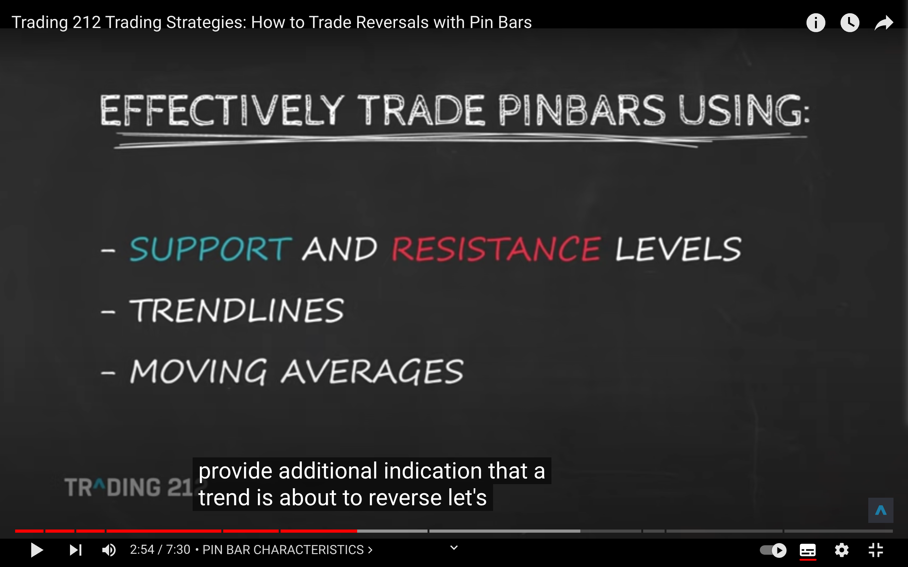
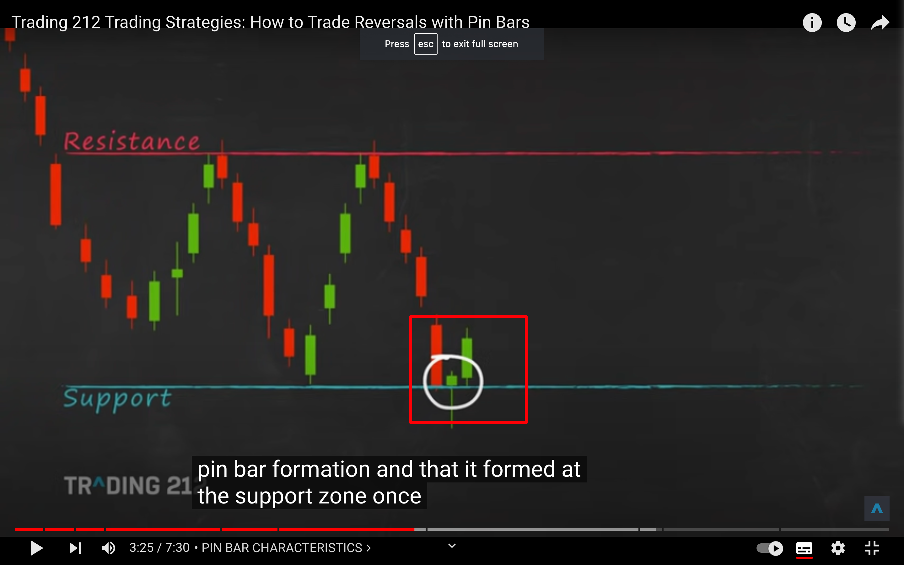

</img>
左侧右侧交易是什么意思  
左侧提前预判，右侧追随趋势
左侧高抛低吸，右侧追涨杀跌  
网格属于左侧  
有说法说 cta 就是追涨杀跌右侧交易，但搜索 cta 却显示不是这意思

## pinbar

</img>  
pinbar，wick much longer than body，是反转信号，适合建仓。
</img>  
其它特征。

</img>  
其余的信息，如 resistance 和 support，压力和支撑位？

</img>  
如只是 pinbar 还无法判断是涨是跌，但因为有支撑位在，就大概率是涨了。

## cpi ConsumerPriceIndex

CPI 一般指消费者物价指数。 是反映一定时期内城乡居民所购买的生活消费品和服务项目价格变动趋势和程度的相对数，是对城市居民消费价格指数和农村居民消费价格指数进行综合汇总计算的结果

简单来说就是消费品物价指数。

cpi 升，物价涨，就加息降低物价，加息了就从币圈吸钱，币价跌。
