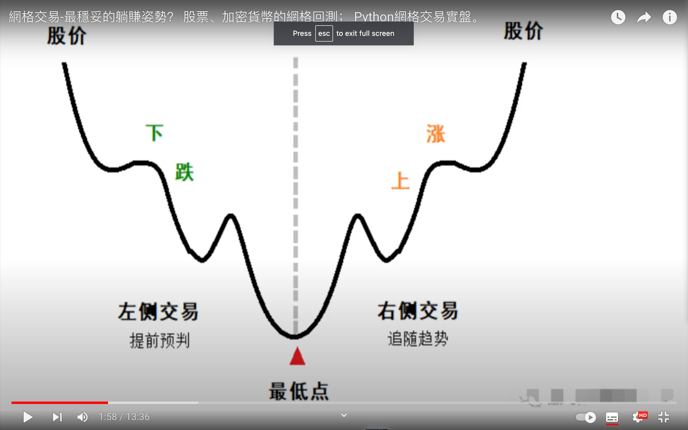
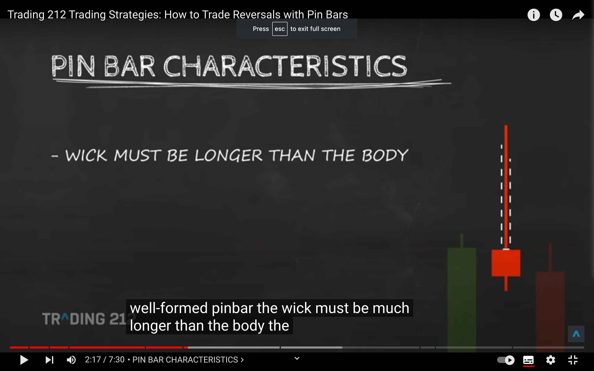
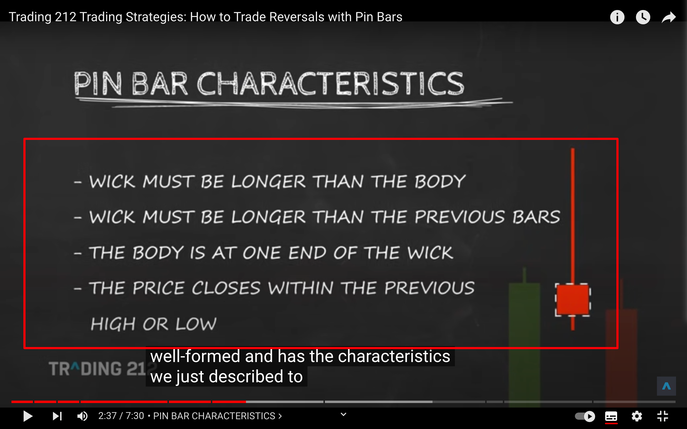

</img>
左侧右侧交易是什么意思  
左侧提前预判，右侧追随趋势
左侧高抛低吸，右侧追涨杀跌  
网格属于左侧  
有说法说 cta 就是追涨杀跌右侧交易，但搜索 cta 却显示不是这意思

## pinbar

</img>  
pinbar，wick much longer than body，是反转信号，适合建仓。
</img>  
其它特征。

</img>  
其余的信息，如 resistance 和 support，压力和支撑位？

</img>  
如只是 pinbar 还无法判断是涨是跌，但因为有支撑位在，就大概率是涨了。

