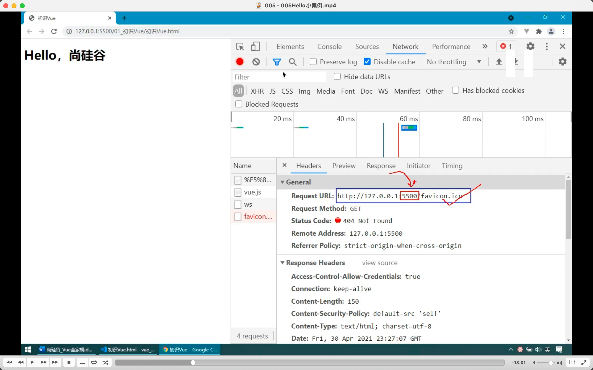
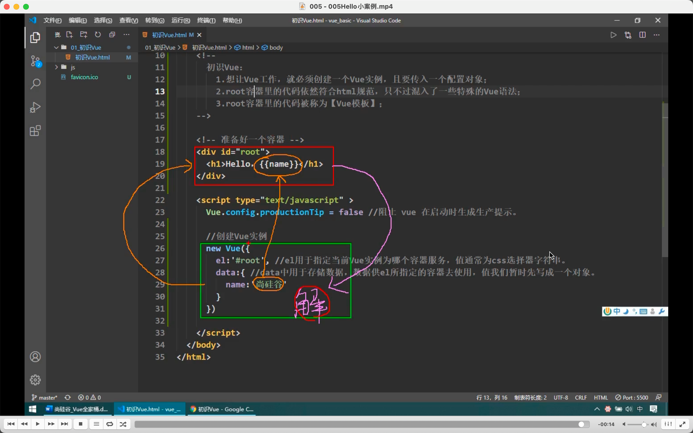

  
favicon.ico 错误。浏览器打开任何网站都会默认请求图标，没写相关代码，所以会报错。

shift 点刷新，强制刷新。如果不强制刷新，可能就不会再重新请求。  
live server 插件，当使用它时就会默认在本地 5500 打开一个服务器。并把工程里所有文件和文件夹作为这服务器的根资源使用。所以把 favicon.ico 粘贴过来就行了。

  
new vue 实际上只有一个参数，只是参数是对象，包括 data，methods 等。  
视频讲解了具体解析过程。

reviewed 2022/07/29
