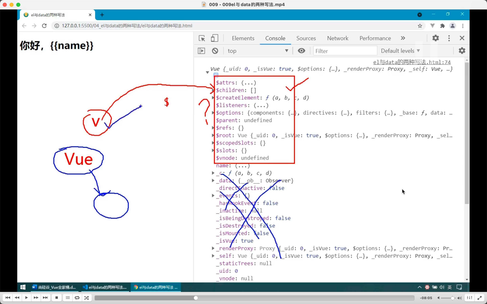
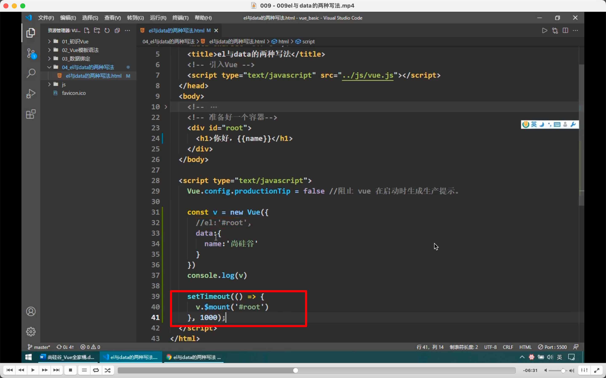
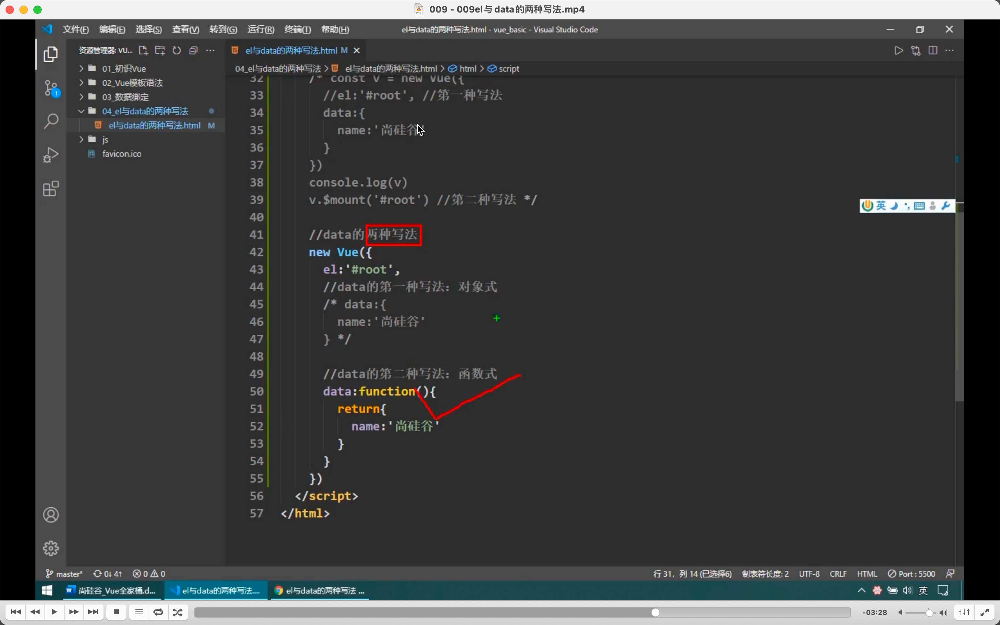
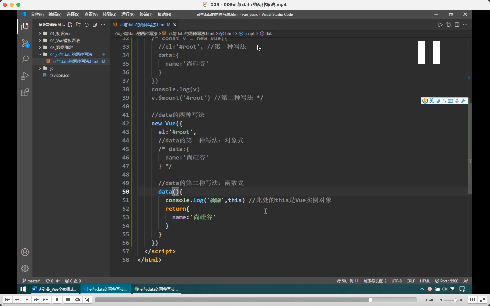

  

输出 vue 实例（而不是 Vue 构造函数）  
以$开始的都是为程序员准备的，不带的是底层在用。

  
  
  
换了一个指定容器的方法。

  
第二种方法的好处是可以更灵活

  
data 的两种写法。有关组件时必须要用到第二种函数式。

  
不能写出箭头函数，箭头函数没有自己的 this，就只能找到外面的 window。

  
一般删掉 function 和:来写。
