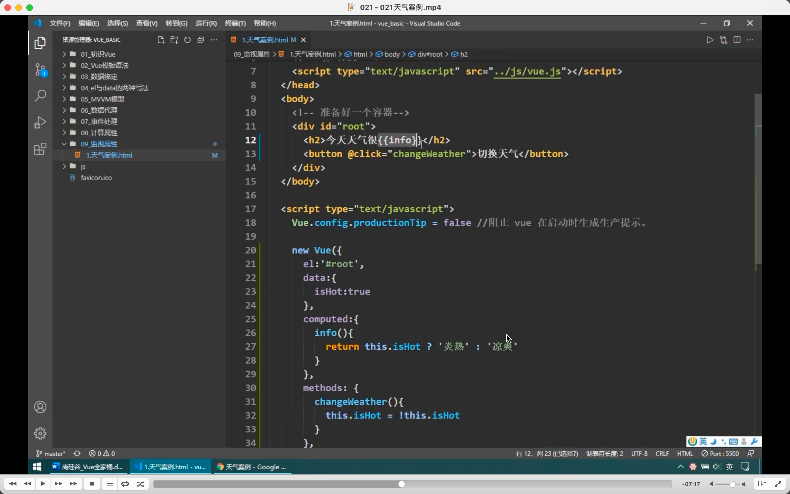
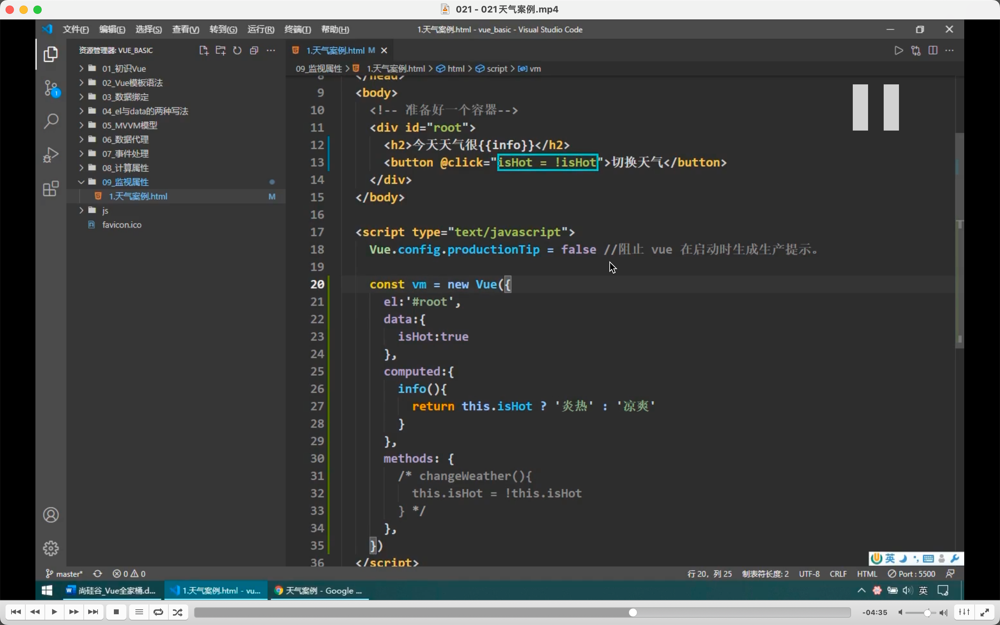
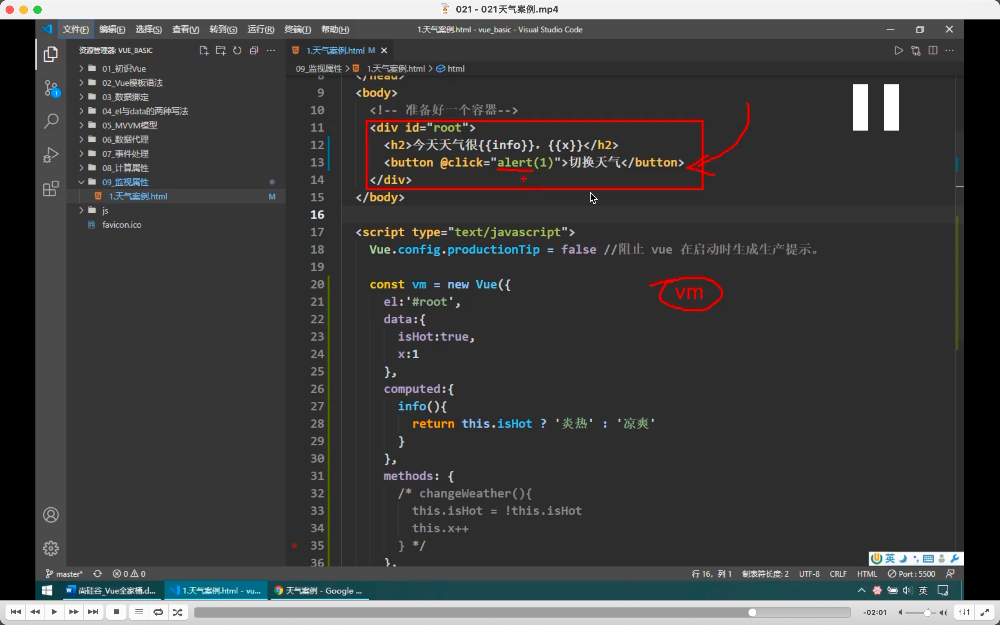

  
一个实例

  
开发者工具坑，如果页面不体现，则工具显示的数据不会变，但实际上 vm 里已经变了。

  
@click 后可以写一些简单的语句，就不用在 methods 里写方法了。

  
可以写多个语句，但容易乱，所以尽量写在 methods 里。

  
不是所有的都能写，比如 alert 它会在 vue 里找，找不到又在 vue 原型里找，但都找不到，因为 alert 是在 windows 里。
