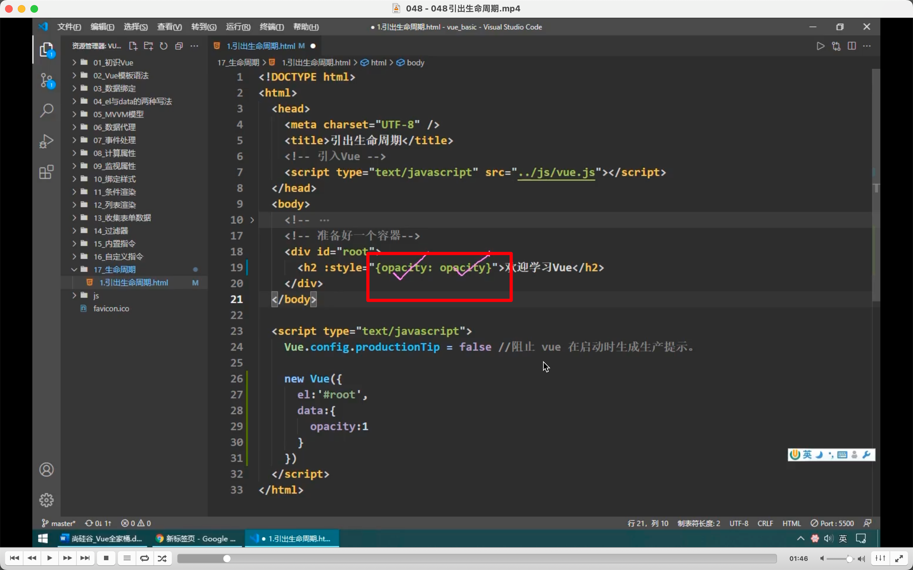  
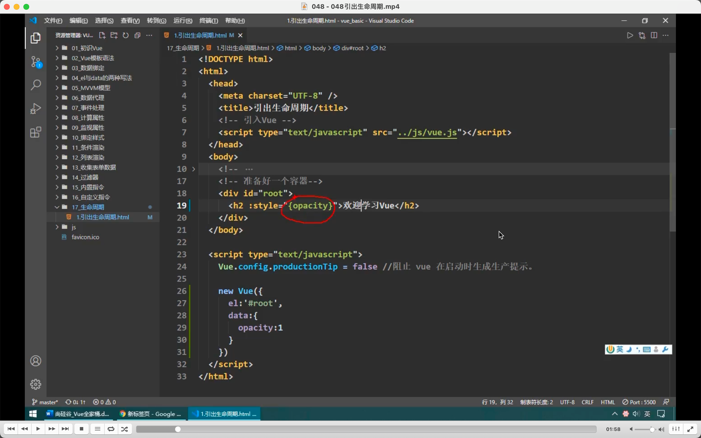  
动态绑定用冒号，且右边需写为对象  
左 opacity 是 css 属性，右 opacity 是数据名。因为重名，所以可以用对象的简写形式，只写一个 opacity。因为引号里是 js 表达式，而且是对象，所以可以用对象的简写形式。

绿色里不是函数体，而是对象里的内容。所以不能直接写 setinterval。只能写 key value。

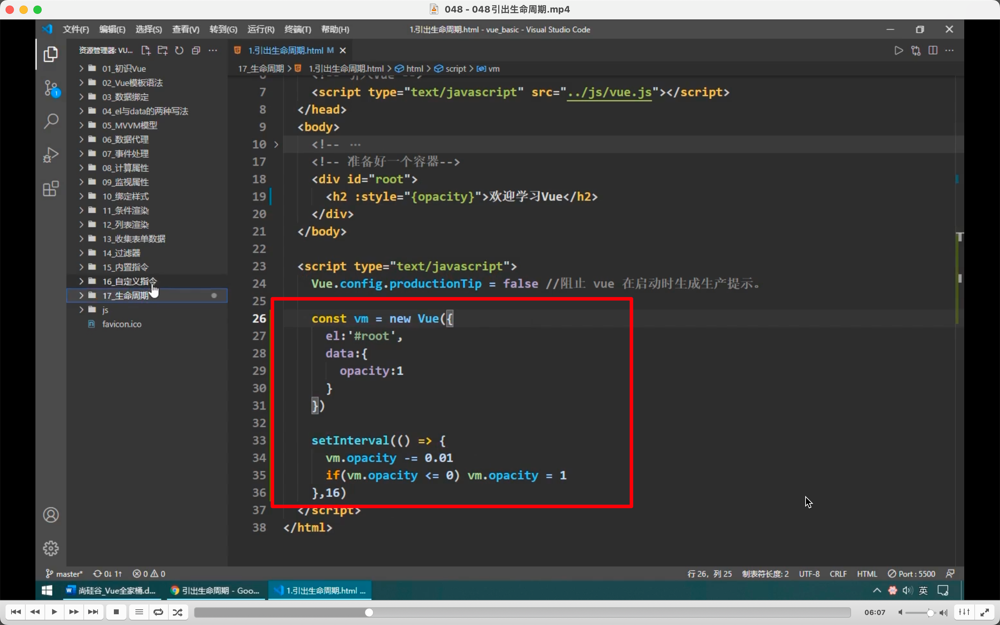  
注意这样写需要加入 vm=new vue。  
这样写可以，但最好都写在 vue 里。

  
这样写会导致指数增加定时器。**因为只要更改了 data 里的数据，vue 就会重新解析模板，进而增加计时器。**

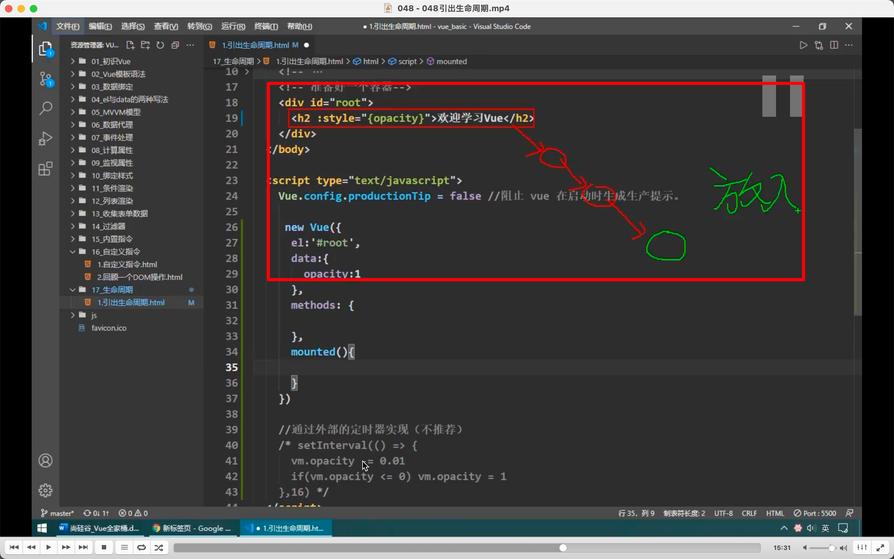
挂载的意思，vue 找到了模板，开启解析变为虚拟 dom，再转为真实 dom。再把真实 dom 元素放入页面。放入就是挂载。

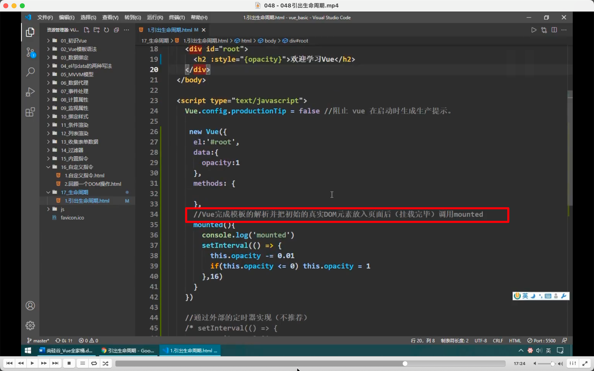  
mounted 的意思

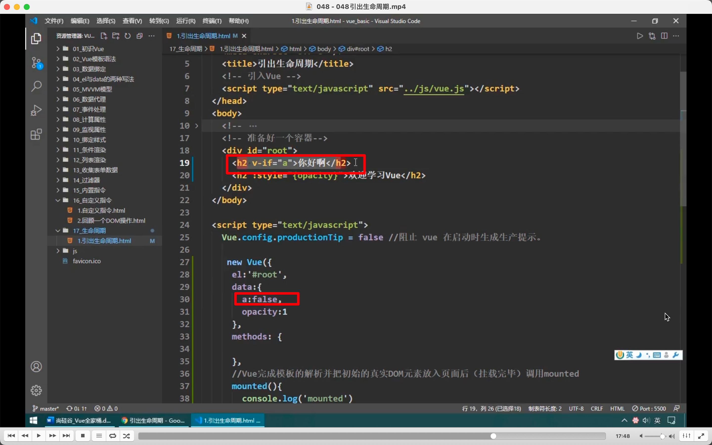  
注意 mounted 需要真实初始的 dom 元素才调用，如这里即使把 false 改为 true，虽然也解析里模板，也弄出了新的 dom 放入页面，但 mounted 不会调用。

生命周期也就是指类似 mounted 这样关键时期调用的函数。

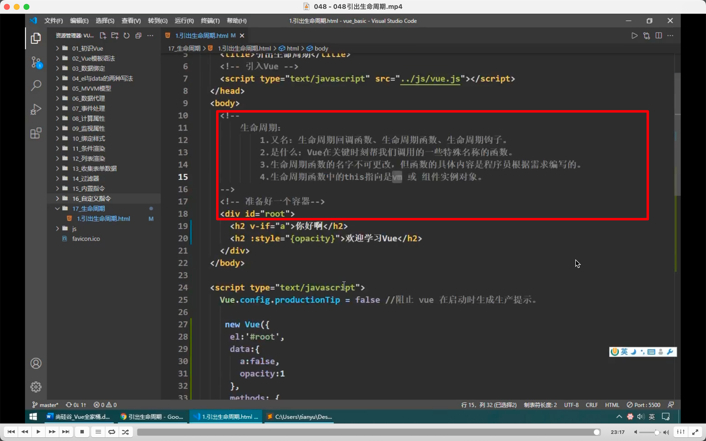  
总结，  
回调函数，callback。也许可以简单理解为定义了，没主动调用，最终却会执行的函数。

此时定义如生命周期函数有几个，叫啥名，啥时候调等。但数据代理没开始，即 data 里的数据 vm 还未收到。vm 还没有 vm.\_data  
beforeCreate 无法访问 data，methods。

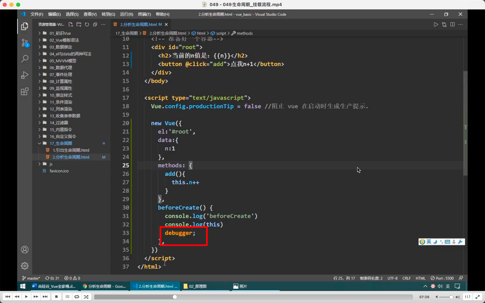  
注意可以写 debugger 暂停程序

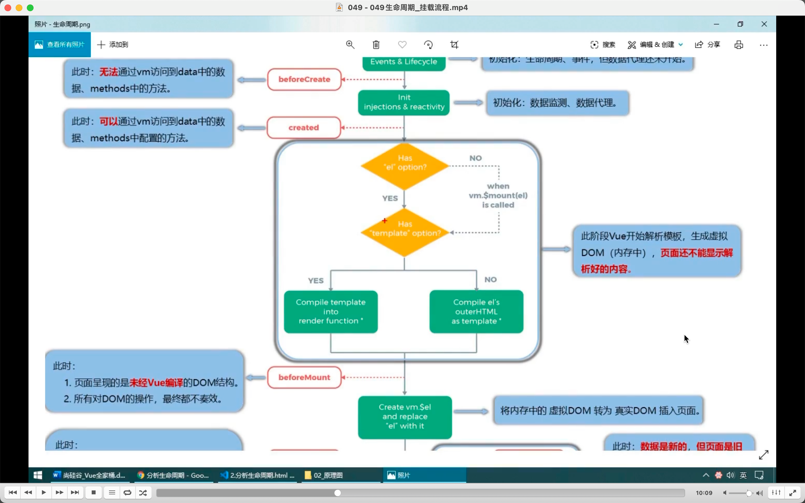  
created 介绍。

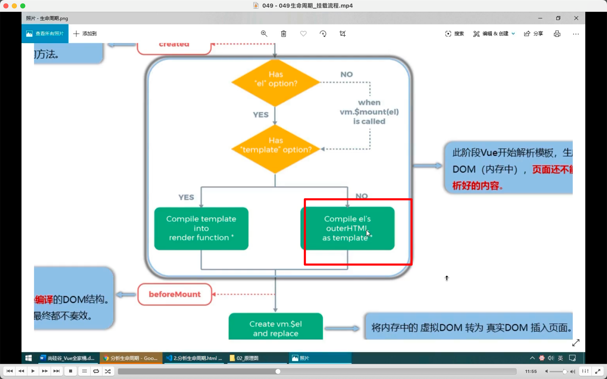  
  

绿色是 el's outer，红色是 el's inner。  
此时:x 也解析了，所以是 el's outer 被解析。

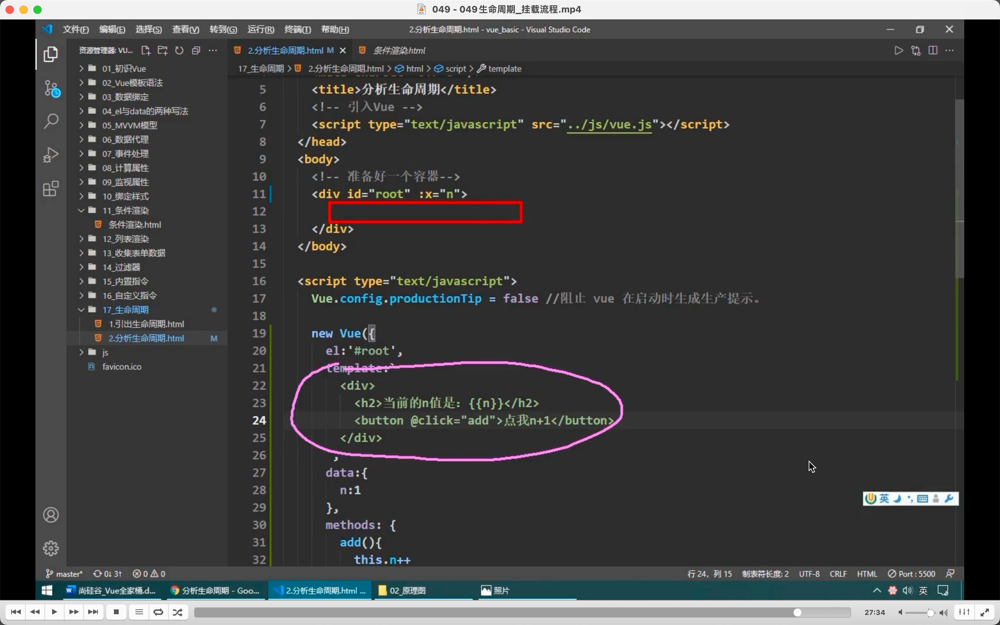  

容器里面可以什么都不写，用 template 代替，但有区别，会替换掉 id=root div。就是图二路线。

### 此节很多内容没记录，需要了解时看视频。
